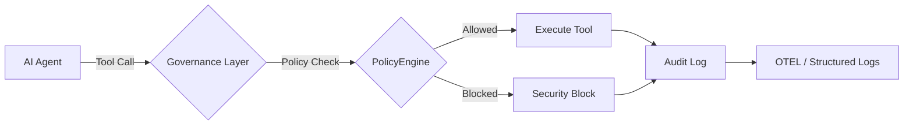

# 🚀 10-Minute Quick Start Guide

Get from zero to governed AI agents in under 10 minutes.

> **Prerequisites:** Python 3.11+ / Node.js 18+ / .NET 8.0+ (any one or more).

## Architecture Overview

The governance layer intercepts every agent action before execution:



## 1. Installation

Install the governance toolkit:

```bash
pip install agent-governance-toolkit[full]
```

Or install individual packages:

```bash
pip install agent-os-kernel        # Policy enforcement + framework integrations
pip install agentmesh-platform     # Zero-trust identity + trust cards
pip install agent-governance-toolkit    # OWASP ASI verification + integrity CLI
pip install agent-sre              # SLOs, error budgets, chaos testing
pip install agentmesh-runtime       # Execution supervisor + privilege rings
pip install agentmesh-marketplace      # Plugin lifecycle management
pip install agentmesh-lightning        # RL training governance
```

### TypeScript / Node.js

```bash
npm install @microsoft/agent-governance-sdk
```

### .NET

```bash
dotnet add package Microsoft.AgentGovernance
```

## 2. Verify Your Installation

Run the included verification script:

```bash
python scripts/check_gov.py
```

Or use the governance CLI directly:

```bash
agt verify
agt verify --badge
```

## 3. Your First Governed Agent

Create a file called `governed_agent.py`:

```python
from agent_os.policies import PolicyEvaluator
from agent_os.policies.schema import (
    PolicyDocument, PolicyRule, PolicyCondition,
    PolicyAction, PolicyOperator, PolicyDefaults,
)

# --- Step 1: Define your agent's tools ---

def web_search(query: str) -> str:
    """Simulated web search tool."""
    return f"Results for: {query}"

def delete_file(path: str) -> str:
    """Dangerous tool — should be blocked by policy."""
    return f"Deleted: {path}"

TOOLS = {
    "web_search": web_search,
    "delete_file": delete_file,
}

# --- Step 2: Define governance policies ---

policy = PolicyDocument(
    name="agent-safety",
    version="1.0",
    description="Safety policy for the research agent",
    defaults=PolicyDefaults(action=PolicyAction.ALLOW),
    rules=[
        PolicyRule(
            name="block-dangerous-tools",
            condition=PolicyCondition(
                field="tool_name",
                operator=PolicyOperator.IN,
                value=["delete_file", "shell_exec", "execute_code"],
            ),
            action=PolicyAction.DENY,
            message="Tool is blocked by safety policy",
            priority=100,
        ),
        PolicyRule(
            name="block-ssn-patterns",
            condition=PolicyCondition(
                field="input_text",
                operator=PolicyOperator.MATCHES,
                value=r"\b\d{3}-\d{2}-\d{4}\b",
            ),
            action=PolicyAction.DENY,
            message="SSN pattern detected — blocked",
            priority=90,
        ),
    ],
)

evaluator = PolicyEvaluator(policies=[policy])

# --- Step 3: Build a governed agent ---

class GovernedAgent:
    """A simple agent that checks policy before every tool call."""

    def __init__(self, name, tools, evaluator):
        self.name = name
        self.tools = tools
        self.evaluator = evaluator

    def call_tool(self, tool_name: str, params: dict) -> str:
        # Policy check BEFORE execution
        decision = self.evaluator.evaluate({
            "tool_name": tool_name,
            "input_text": str(params),
            "agent_id": self.name,
        })

        if not decision.allowed:
            print(f"  ✗ BLOCKED: {decision.reason}")
            return f"[BLOCKED] {decision.reason}"

        # Execute the tool
        print(f"  ✓ ALLOWED: {tool_name}")
        tool_fn = self.tools[tool_name]
        return tool_fn(**params)

# --- Step 4: Run it ---

agent = GovernedAgent("research-agent", TOOLS, evaluator)

print("Agent: searching the web...")
result = agent.call_tool("web_search", {"query": "latest AI governance news"})
print(f"  Result: {result}\n")

print("Agent: trying to delete a file...")
result = agent.call_tool("delete_file", {"path": "/etc/passwd"})
print(f"  Result: {result}\n")

print("Agent: searching with SSN in query...")
result = agent.call_tool("web_search", {"query": "lookup 123-45-6789"})
print(f"  Result: {result}")
```

Run it:

```bash
python governed_agent.py
```

Expected output:

```
Agent: searching the web...
  ✓ ALLOWED: web_search
  Result: Results for: latest AI governance news

Agent: trying to delete a file...
  ✗ BLOCKED: Tool is blocked by safety policy
  Result: [BLOCKED] Tool is blocked by safety policy

Agent: searching with SSN in query...
  ✗ BLOCKED: SSN pattern detected — blocked
  Result: [BLOCKED] SSN pattern detected — blocked
```

The governance layer intercepts **every tool call** before execution — the agent never gets to run `delete_file` or leak PII.

### Load Policies from YAML

For production, define policies in YAML files instead of inline code:

```python
from agent_os.policies import PolicyEvaluator

evaluator = PolicyEvaluator()
evaluator.load_policies("policies/")   # loads all *.yaml files

result = evaluator.evaluate({"tool_name": "web_search", "agent_id": "analyst-1"})
print(f"Allowed: {result.allowed}")
```

### Your First Governed Agent — TypeScript

Create a file called `governed_agent.ts`:

```typescript
import { PolicyEngine, AgentIdentity, AuditLogger } from "@microsoft/agent-governance-sdk";

const identity = AgentIdentity.generate("my-agent", ["web_search", "read_file"]);

const engine = new PolicyEngine([
  { action: "web_search", effect: "allow" },
  { action: "delete_file", effect: "deny" },
]);

console.log(engine.evaluate("web_search"));  // "allow"
console.log(engine.evaluate("delete_file")); // "deny"
```

### Your First Governed Agent — .NET

Create a file called `GovernedAgent.cs`:

```csharp
using AgentGovernance;
using AgentGovernance.Policy;

var kernel = new GovernanceKernel(new GovernanceOptions
{
    PolicyPaths = new() { "policies/default.yaml" },
    EnablePromptInjectionDetection = true,
});

var result = kernel.EvaluateToolCall("did:mesh:agent-1", "web_search", new() { ["query"] = "AI news" });
Console.WriteLine($"Allowed: {result.Allowed}");  // True (if policy permits)

result = kernel.EvaluateToolCall("did:mesh:agent-1", "delete_file", new() { ["path"] = "/etc/passwd" });
Console.WriteLine($"Allowed: {result.Allowed}");  // False
```

## 4. Wrap an Existing Framework

The toolkit integrates with all major agent frameworks. Here's a LangChain example:

```python
from agent_os.policies import PolicyEvaluator

# Load your governance policies
evaluator = PolicyEvaluator()
evaluator.load_policies("policies/")

# Evaluate before every tool call in your framework
decision = evaluator.evaluate({
    "agent_id": "langchain-agent-1",
    "tool_name": "web_search",
    "action": "tool_call",
})

if decision.allowed:
    # proceed with LangChain tool call
    result = your_langchain_agent.run(...)
else:
    print(f"Blocked: {decision.reason}")
```

For deeper integration, use framework-specific adapters:

```bash
pip install langchain-agentmesh      # LangChain adapter
pip install llamaindex-agentmesh     # LlamaIndex adapter
pip install crewai-agentmesh         # CrewAI adapter
```

Supported frameworks: **LangChain**, **OpenAI Agents SDK**, **AutoGen**, **CrewAI**,
**Google ADK**, **Semantic Kernel**, **LlamaIndex**, **Anthropic**, **Mistral**, **Gemini**, and more.

## 5. Check OWASP ASI 2026 Coverage

Verify your deployment covers the OWASP Agentic Security Threats:

```bash
# Text summary
agt verify

# JSON for CI/CD pipelines
agt verify --json

# Badge for your README
agt verify --badge
```

### Secure Error Handling

All CLI tools in the toolkit are hardened to prevent internal information disclosure. If a command fails in JSON mode, it returns a sanitized schema:

```json
{
  "status": "error",
  "message": "An internal error occurred during verification",
  "type": "InternalError"
}
```

Known errors (e.g., "File not found") will include the specific error message, while unexpected system errors are masked to ensure security integrity.

## 6. Verify Module Integrity

Ensure no governance modules have been tampered with:

```bash
# Generate a baseline integrity manifest
agt integrity --generate integrity.json

# Verify against the manifest later
agt integrity --manifest integrity.json
```

## Next Steps

| What | Where |
|------|-------|
| Full API reference (Python) | [agent-governance-python/agent-os/README.md](agent-governance-python/agent-os/README.md) |
| TypeScript package docs | [agent-governance-typescript/README.md](agent-governance-typescript/README.md) |
| .NET package docs | [agent-governance-dotnet/README.md](agent-governance-dotnet/README.md) |
| OWASP coverage map | [docs/OWASP-COMPLIANCE.md](docs/OWASP-COMPLIANCE.md) |
| Framework integrations | [agent-governance-python/agent-os/src/agent_os/integrations/](agent-governance-python/agent-os/src/agent_os/integrations/) |
| Example applications | [agent-governance-python/agent-os/examples/](agent-governance-python/agent-os/examples/) |
| Contributing | [CONTRIBUTING.md](CONTRIBUTING.md) |
| Changelog | [CHANGELOG.md](CHANGELOG.md) |

---

*Based on the initial quickstart contribution by [@davidequarracino](https://github.com/davidequarracino) ([#106](https://github.com/microsoft/agent-governance-toolkit/pull/106), [#108](https://github.com/microsoft/agent-governance-toolkit/pull/108)).*

