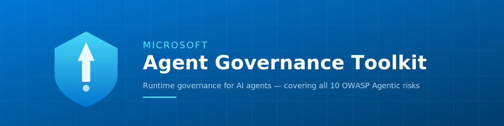

🌍 [English](/README.md) | [日本語](./docs/i18n/README.ja.md) | [简体中文](./docs/i18n/README.zh-CN.md)



# Agent Governance Toolkit

[](https://github.com/microsoft/agent-governance-toolkit/actions/workflows/ci.yml)
[](LICENSE)
[](https://pypi.org/project/agent-governance-toolkit/)
[](docs/OWASP-COMPLIANCE.md)
[](https://scorecard.dev/viewer/?uri=github.com/microsoft/agent-governance-toolkit)
[](https://deepwiki.com/microsoft/agent-governance-toolkit)

> [!IMPORTANT]
> **Public Preview** — Microsoft-signed, production-quality releases. May have breaking changes before GA.
> [Open a GitHub issue](https://github.com/microsoft/agent-governance-toolkit/issues) for feedback.

> [!TIP]
> **v3.2.1 is out!** Patch: encryption exports fix for npm package. E2E encrypted agent messaging (Signal protocol), Wire Protocol spec, registry + relay services. [Changelog →](CHANGELOG.md)

**Runtime governance for AI agents** — deterministic policy enforcement, zero-trust identity, execution sandboxing, and SRE for autonomous agents. Covers all **10 OWASP Agentic risks** with **9,500+ tests**.

**Works with any stack** — AWS Bedrock, Google ADK, Azure AI, LangChain, CrewAI, AutoGen, OpenAI Agents, and 20+ more. Python · TypeScript · .NET · Rust · Go.

---

## What This Is (and Isn't)

**What it does:** Sits between your agent framework and the actions agents take. Every tool call, resource access, and inter-agent message is evaluated against policy *before* execution. Deterministic — not probabilistic.

**What it doesn't do:** This is not a prompt guardrail or content moderation tool. It governs agent *actions*, not LLM inputs/outputs. For model-level safety, see [Azure AI Content Safety](https://learn.microsoft.com/azure/ai-services/content-safety/).

```
Agent Action ──► Policy Check ──► Allow / Deny ──► Audit Log    (< 0.1 ms)
```

**Why it matters:** Prompt-based safety ("please follow the rules") has a [26.67% policy violation rate](docs/BENCHMARKS.md) in red-team testing. AGT's deterministic application-layer enforcement: **0.00%**.

---

## Get Started in 90 Seconds

```bash
# 1. Install
pip install agent-governance-toolkit[full]

# 2. Check your installation
agt doctor

# 3. Verify OWASP compliance
agt verify

# 4. Verify runtime evidence, when available
agt verify --evidence ./agt-evidence.json

# 5. Fail CI on weak runtime evidence
agt verify --evidence ./agt-evidence.json --strict
```

Then govern your first action:

```python
from agent_os.policies import PolicyEvaluator, PolicyDocument, PolicyRule, PolicyCondition, PolicyAction, PolicyOperator, PolicyDefaults

evaluator = PolicyEvaluator(policies=[PolicyDocument(
    name="my-policy", version="1.0",
    defaults=PolicyDefaults(action=PolicyAction.ALLOW),
    rules=[PolicyRule(
        name="block-dangerous-tools",
        condition=PolicyCondition(field="tool_name", operator=PolicyOperator.IN, value=["execute_code", "delete_file"]),
        action=PolicyAction.DENY, priority=100,
    )],
)])

result = evaluator.evaluate({"tool_name": "web_search"})    # ✅ Allowed
result = evaluator.evaluate({"tool_name": "delete_file"})   # ❌ Blocked deterministically
```

<details>
<summary><b>TypeScript</b></summary>

```typescript
import { PolicyEngine } from "@microsoft/agentmesh-sdk";

const engine = new PolicyEngine([
  { action: "web_search", effect: "allow" },
  { action: "shell_exec", effect: "deny" },
]);
engine.evaluate("web_search"); // "allow"
engine.evaluate("shell_exec"); // "deny"
```

</details>

<details>
<summary><b>.NET</b></summary>

```csharp
using AgentGovernance;
using AgentGovernance.Policy;

var kernel = new GovernanceKernel(new GovernanceOptions
{
    PolicyPaths = new() { "policies/default.yaml" },
});

var result = kernel.EvaluateToolCall("did:mesh:agent-1", "web_search",
    new() { ["query"] = "latest AI news" });
// result.Allowed == true
```

</details>

<details>
<summary><b>Rust</b></summary>

```rust
use agentmesh::{AgentMeshClient, ClientOptions};

let client = AgentMeshClient::new("my-agent").unwrap();
let result = client.execute_with_governance("data.read", None);
assert!(result.allowed);
```

</details>

<details>
<summary><b>Go</b></summary>

```go
import agentmesh "github.com/microsoft/agent-governance-toolkit/agent-governance-golang"

client, _ := agentmesh.NewClient("my-agent",
    agentmesh.WithPolicyRules([]agentmesh.PolicyRule{
        {Action: "data.read", Effect: agentmesh.Allow},
        {Action: "*", Effect: agentmesh.Deny},
    }),
)
result := client.ExecuteWithGovernance("data.read", nil)
// result.Allowed == true
```

</details>

> **Full walkthrough:** [QUICKSTART.md](QUICKSTART.md) — zero to governed agents in 10 minutes with YAML policies, OPA/Rego, and Cedar support.
> 🌍 Also available in: [日本語](docs/i18n/QUICKSTART.ja.md) | [简体中文](docs/i18n/QUICKSTART.zh-CN.md)

---

## What You Get

| Capability | What It Does | Links |
|---|---|---|
| **Policy Engine** | Every action evaluated before execution — sub-millisecond, deterministic. Supports YAML, OPA/Rego, and Cedar policies | [Agent OS](packages/agent-os/) · [Benchmarks](docs/BENCHMARKS.md) |
| **Zero-Trust Identity** | Ed25519 + quantum-safe ML-DSA-65 credentials, trust scoring (0–1000), SPIFFE/SVID | [AgentMesh](packages/agent-mesh/) |
| **Execution Sandboxing** | 4-tier privilege rings, saga orchestration, kill switch | [Runtime](packages/agent-runtime/) · [Hypervisor](packages/agent-hypervisor/) |
| **Agent SRE** | SLOs, error budgets, replay debugging, chaos engineering, circuit breakers | [Agent SRE](packages/agent-sre/) |
| **MCP Security Scanner** | Detect tool poisoning, typosquatting, hidden instructions in MCP definitions | [MCP Scanner](packages/agent-os/src/agent_os/mcp_security.py) |
| **Shadow AI Discovery** | Find unregistered agents across processes, configs, and repos | [Agent Discovery](packages/agent-discovery/) |
| **Agent Lifecycle** | Provisioning → credential rotation → orphan detection → decommissioning | [Lifecycle](packages/agent-mesh/src/agentmesh/lifecycle/) |
| **Governance Dashboard** | Real-time fleet visibility — health, trust, compliance, audit events | [Dashboard](demo/governance-dashboard/) |
| **Unified CLI** | `agt verify`, `agt doctor`, `agt lint-policy` — one command for everything | [CLI](packages/agent-compliance/src/agent_compliance/cli/agt.py) |
| **PromptDefense Evaluator** | 12-vector prompt injection audit for compliance testing | [Evaluator](packages/agent-compliance/src/agent_compliance/prompt_defense.py) |

---

## Works With Your Stack

| Framework | Integration |
|-----------|-------------|
| [**Microsoft Agent Framework**](https://github.com/microsoft/agent-framework) | Native Middleware |
| [**Semantic Kernel**](https://github.com/microsoft/semantic-kernel) | Native (.NET + Python) |
| [Microsoft AutoGen](https://github.com/microsoft/autogen) | Adapter |
| [LangGraph](https://github.com/langchain-ai/langgraph) / [LangChain](https://github.com/langchain-ai/langchain) | Adapter |
| [CrewAI](https://github.com/crewAIInc/crewAI) | Adapter |
| [OpenAI Agents SDK](https://github.com/openai/openai-agents-python) | Middleware |
| [pi-mono](https://github.com/badlogic/pi-mono/tree/main/packages/coding-agent) | TypeScript SDK Integration |
| [Google ADK](https://github.com/google/adk-python) | Adapter |
| [LlamaIndex](https://github.com/run-llama/llama_index) | Middleware |
| [Haystack](https://github.com/deepset-ai/haystack) | Pipeline |
| [Dify](https://github.com/langgenius/dify) | Plugin |
| [Azure AI Foundry](https://learn.microsoft.com/azure/ai-studio/) | Deployment Guide |

Full list: [Framework Integrations](packages/agentmesh-integrations/) · [Quickstart Examples](examples/quickstart/)

---

## OWASP Agentic Top 10 — 10/10 Covered

| Risk | ID | AGT Control |
|------|----|-------------|
| Agent Goal Hijacking | ASI-01 | Policy engine blocks unauthorized goal changes |
| Excessive Capabilities | ASI-02 | Capability model enforces least-privilege |
| Identity & Privilege Abuse | ASI-03 | Zero-trust identity with Ed25519 + ML-DSA-65 |
| Uncontrolled Code Execution | ASI-04 | Execution rings + sandboxing |
| Insecure Output Handling | ASI-05 | Content policies validate all outputs |
| Memory Poisoning | ASI-06 | Episodic memory with integrity checks |
| Unsafe Inter-Agent Comms | ASI-07 | Encrypted channels + trust gates |
| Cascading Failures | ASI-08 | Circuit breakers + SLO enforcement |
| Human-Agent Trust Deficit | ASI-09 | Full audit trails + flight recorder |
| Rogue Agents | ASI-10 | Kill switch + ring isolation + anomaly detection |

Full mapping: [OWASP-COMPLIANCE.md](docs/OWASP-COMPLIANCE.md) · Regulatory alignment: [EU AI Act](docs/compliance/), [NIST AI RMF](docs/compliance/nist-ai-rmf-alignment.md), [Colorado AI Act](docs/compliance/)

---

## Performance

Governance adds **< 0.1 ms per action** — roughly 10,000× faster than an LLM API call.

| Metric | Latency (p50) | Throughput |
|---|---|---|
| Policy evaluation (1 rule) | 0.012 ms | 72K ops/sec |
| Policy evaluation (100 rules) | 0.029 ms | 31K ops/sec |
| Policy enforcement | 0.091 ms | 9.3K ops/sec |
| Concurrent (50 agents) | — | 35,481 ops/sec |

> **Note:** These numbers measure policy evaluation only. In distributed multi-agent
> deployments, add ~5–50ms for cryptographic verification and mesh handshake on
> inter-agent messages. See [Limitations — Performance](docs/LIMITATIONS.md#3-performance-policy-eval-vs-end-to-end) for full breakdown.

Full methodology: [BENCHMARKS.md](docs/BENCHMARKS.md)

---

## Install

| Language | Package | Command |
|----------|---------|---------|
| **Python** | [`agent-governance-toolkit`](https://pypi.org/project/agent-governance-toolkit/) | `pip install agent-governance-toolkit[full]` |
| **TypeScript** | [`@microsoft/agentmesh-sdk`](packages/agent-mesh/sdks/typescript/) | `npm install @microsoft/agentmesh-sdk` |
| **.NET** | [`Microsoft.AgentGovernance`](https://www.nuget.org/packages/Microsoft.AgentGovernance) | `dotnet add package Microsoft.AgentGovernance` |
| **Rust** | [`agentmesh`](https://crates.io/crates/agentmesh) | `cargo add agentmesh` |
| **Go** | [`agent-governance-toolkit`](agent-governance-golang/) | `go get github.com/microsoft/agent-governance-toolkit/agent-governance-golang` |

All 5 SDKs implement core governance (policy, identity, trust, audit). Python has the full stack.
See **[SDK Feature Matrix](docs/SDK-FEATURE-MATRIX.md)** for detailed per-language coverage.

<details>
<summary><b>Individual Python packages</b></summary>

| Package | PyPI | Description |
|---------|------|-------------|
| Agent OS | [`agent-os-kernel`](https://pypi.org/project/agent-os-kernel/) | Policy engine, capability model, audit logging, MCP gateway |
| AgentMesh | [`agentmesh-platform`](https://pypi.org/project/agentmesh-platform/) | Zero-trust identity, trust scoring, A2A/MCP/IATP bridges |
| Agent Runtime | [`agentmesh-runtime`](packages/agent-runtime/) | Privilege rings, saga orchestration, termination control |
| Agent SRE | [`agent-sre`](https://pypi.org/project/agent-sre/) | SLOs, error budgets, chaos engineering, circuit breakers |
| Agent Compliance | [`agent-governance-toolkit`](https://pypi.org/project/agent-governance-toolkit/) | OWASP verification, integrity checks, policy linting |
| Agent Discovery | [`agent-discovery`](packages/agent-discovery/) | Shadow AI discovery, inventory, risk scoring |
| Agent Hypervisor | [`agent-hypervisor`](packages/agent-hypervisor/) | Reversibility verification, execution plan validation |
| Agent Marketplace | [`agentmesh-marketplace`](packages/agent-marketplace/) | Plugin lifecycle management |
| Agent Lightning | [`agentmesh-lightning`](packages/agent-lightning/) | RL training governance |

</details>

---

## Documentation

**Getting Started**
- [Quick Start](QUICKSTART.md) — Zero to governed agents in 10 minutes
- [Tutorials](docs/tutorials/) — 31 numbered tutorials + 7-chapter Policy-as-Code deep dive
- [FAQ](docs/FAQ.md) — Technical Q&A for customers, partners, and evaluators

**Architecture & Reference**
- [SDK Feature Matrix](docs/SDK-FEATURE-MATRIX.md) — Per-language capability comparison
- [Architecture](docs/ARCHITECTURE.md) — System design, security model, trust scoring
- [Architecture Decisions](docs/adr/README.md) — ADR log
- [Threat Model](docs/THREAT_MODEL.md) — Trust boundaries and STRIDE analysis
- [API: Agent OS](packages/agent-os/README.md) · [AgentMesh](packages/agent-mesh/README.md) · [Agent SRE](packages/agent-sre/README.md)

**Compliance & Deployment**
- [Known Limitations](docs/LIMITATIONS.md) — Honest design boundaries and recommended layered defense
- [OWASP Compliance](docs/OWASP-COMPLIANCE.md) — Full ASI-01 through ASI-10 mapping
- [Deployment Guides](docs/deployment/README.md) — Azure (AKS, Foundry, Container Apps), AWS (ECS/Fargate), GCP (GKE), Docker Compose
- [NIST AI RMF Alignment](docs/compliance/nist-ai-rmf-alignment.md) · [EU AI Act](docs/compliance/) · [SOC 2 Mapping](docs/compliance/soc2-mapping.md)

**Extensions**
- [VS Code Extension](packages/agent-os-vscode/) · [Framework Integrations](packages/agentmesh-integrations/)

---

## Security

This toolkit provides **application-level governance** (Python middleware), not OS kernel-level isolation. The policy engine and agents run in the same process — the same trust boundary as every Python agent framework.

**Production recommendation:** Run each agent in a separate container for OS-level isolation. See [Architecture — Security Boundaries](docs/ARCHITECTURE.md).

> **📖 [Known Limitations & Design Boundaries](docs/LIMITATIONS.md)** — what AGT does *not* do, honest performance numbers for distributed deployments, and the recommended layered defense architecture.

| Tool | Coverage |
|------|----------|
| CodeQL | Python + TypeScript SAST |
| Gitleaks | Secret scanning on PR/push/weekly |
| ClusterFuzzLite | 7 fuzz targets (policy, injection, MCP, sandbox, trust) |
| Dependabot | 13 ecosystems |
| OpenSSF Scorecard | Weekly scoring + SARIF upload |

---

## Contributing

- [Contributing Guide](CONTRIBUTING.md) · [Community](docs/COMMUNITY.md) · [Security Policy](SECURITY.md) · [Changelog](CHANGELOG.md)

**Using AGT?** Add your organization to [ADOPTERS.md](docs/ADOPTERS.md) — it helps the project gain momentum and helps others discover real-world use cases.

## Important Notes

If you use the Agent Governance Toolkit to build applications that operate with third-party agent frameworks or services, you do so at your own risk. We recommend reviewing all data being shared with third-party services and being cognizant of third-party practices for retention and location of data.

## License

This project is licensed under the [MIT License](LICENSE).

## Trademarks

This project may contain trademarks or logos for projects, products, or services. Authorized use of Microsoft
trademarks or logos is subject to and must follow
[Microsoft's Trademark & Brand Guidelines](https://www.microsoft.com/en-us/legal/intellectualproperty/trademarks/usage/general).
Use of Microsoft trademarks or logos in modified versions of this project must not cause confusion or imply Microsoft sponsorship.
Any use of third-party trademarks or logos are subject to those third-party's policies.
