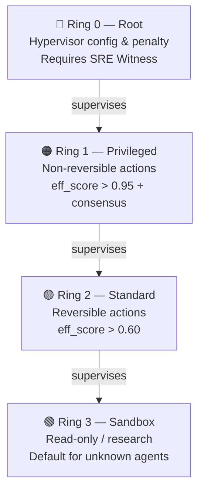
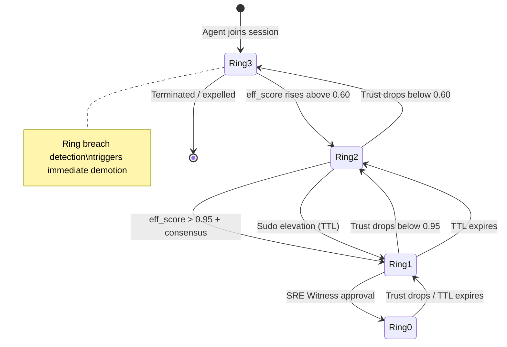
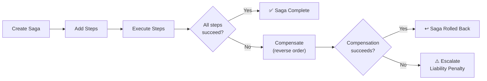
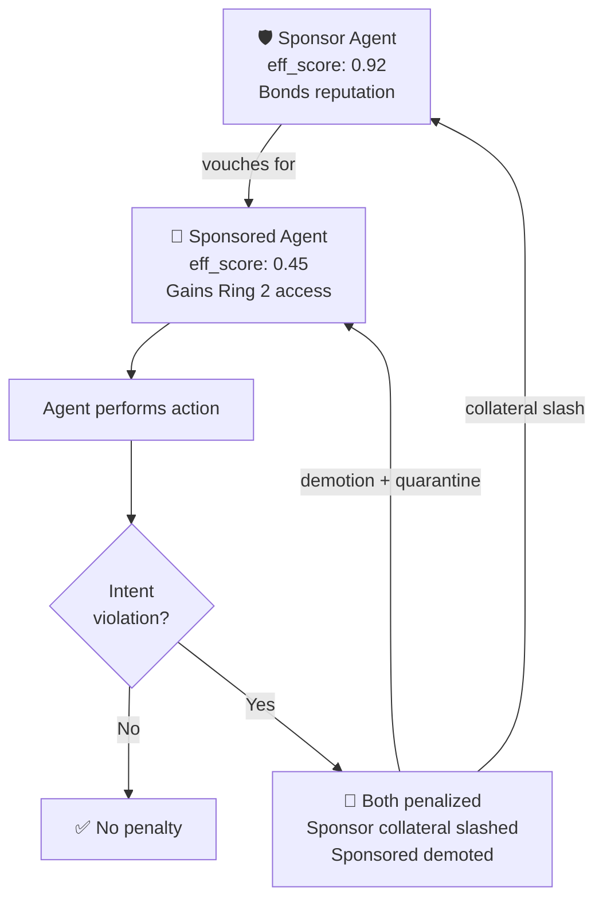
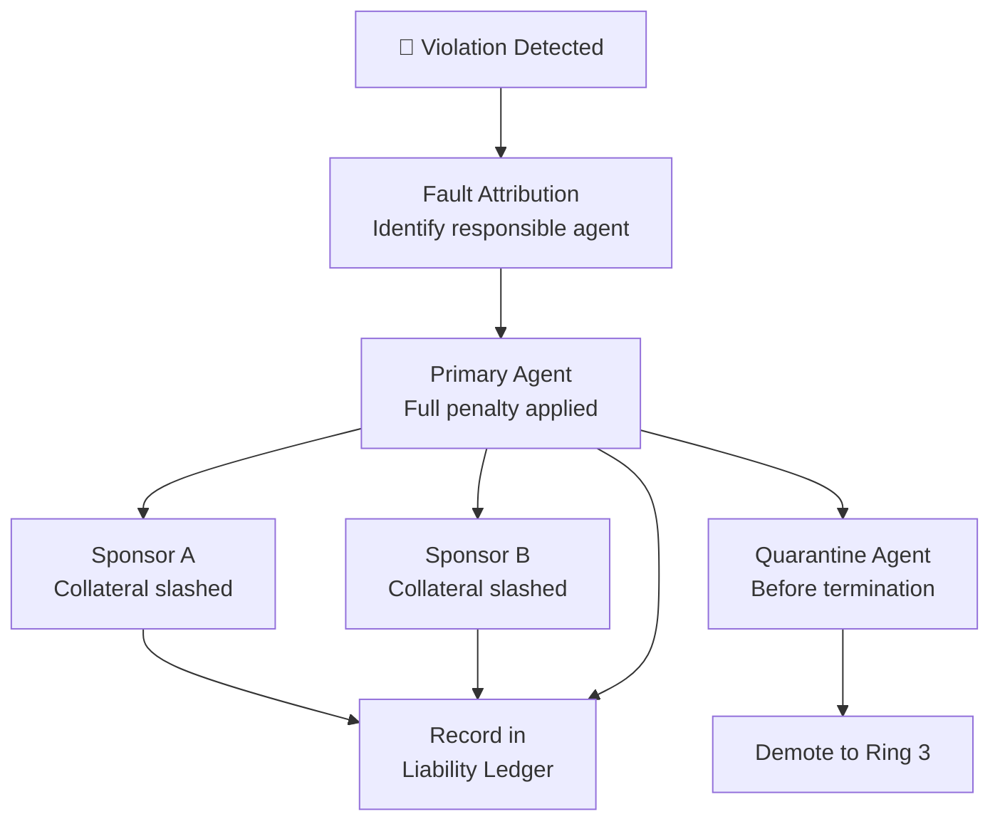
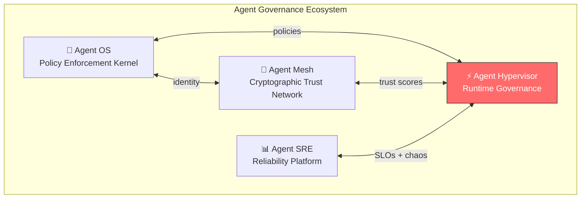

<div align="center">

# Agent Hypervisor — Public Preview

**Execution supervisor for AI agents — runtime isolation, execution rings, and governance for autonomous agents**

*Just as a supervisor isolates processes, Agent Hypervisor isolates AI agent sessions<br/>and enforces governance boundaries with a kill switch, blast radius containment, and accountability.*

[](https://github.com/microsoft/agent-governance-toolkit/actions/workflows/ci.yml)
[](../../LICENSE)
[](https://python.org)
[](https://pypi.org/project/agent-governance-python/agent-hypervisor/)
[](benchmarks/)
[](https://github.com/microsoft/agent-governance-toolkit/discussions)

> [!IMPORTANT]
> **Public Preview** — The `agent-hypervisor` package on PyPI is a Microsoft-signed
> public preview release. APIs may change before GA.

> ⭐ **If this project helps you, please star it!** It helps others discover Agent Hypervisor.

> 📦 **Install the full stack:** `pip install agent-governance-toolkit[full]` — [PyPI](https://pypi.org/project/ai-agent-governance/) | [GitHub](https://github.com/microsoft/agent-governance-toolkit)

[Quick Start](#quick-start) • [Configuration](#configuration) • [Why a Hypervisor?](#-why-agent-hypervisor) • [Features](#key-features) • [Architecture](#architecture-diagrams) • [Performance](#performance) • [Ecosystem](#ecosystem)

</div>

---

### Integrated Into Major AI Frameworks

<p align="center">
  <a href="https://github.com/langgenius/dify-plugins/pull/2060"></a>
  <a href="https://github.com/run-llama/llama_index/pull/20644"></a>
  <a href="https://github.com/github/awesome-copilot/pull/755"></a>
  <a href="https://github.com/microsoft/agent-governance-python/agent-lightning/pull/478"></a>
  <a href="https://github.com/magsther/awesome-opentelemetry/pull/24"></a>
</p>

## 📊 By The Numbers

<table>
<tr>
<td align="center"><h3>644+</h3><sub>Tests Passing</sub></td>
<td align="center"><h3>4</h3><sub>Execution Rings<br/>(Ring 0–3)</sub></td>
<td align="center"><h3>268μs</h3><sub>Full Governance<br/>Pipeline Latency</sub></td>
<td align="center"><h3>v2.0</h3><sub>Saga Compensation<br/>Kill Switch · Rate Limits</sub></td>
</tr>
</table>

## 💡 Why Agent Hypervisor?

> **The problem:** AI agents run with unlimited resources, no isolation, and no kill switch. A single rogue agent in a shared session can escalate privileges, corrupt state, or cascade failures across your entire system.

> **Our solution:** A hypervisor that enforces execution rings, resource limits, saga compensation, and runtime governance — giving you a kill switch, blast radius containment, and joint liability for agent accountability.

### How It Maps to What You Already Know

| OS / VM Hypervisor | Agent Hypervisor | Why It Matters |
|-------------------|-----------------|----------------|
| CPU rings (Ring 0–3) | **Execution Rings** — privilege levels based on trust score | Graduated access, not binary allow/deny |
| Process isolation | **Session isolation** — VFS namespacing, DID-bound identity | Rogue agents can't corrupt other sessions |
| Memory protection | **Liability protection** — bonded reputation, collateral slash | Sponsors have skin in the game |
| System calls | **Saga transactions** — multi-step ops with automatic rollback | Failed workflows undo themselves |
| Watchdog timer | **Kill switch** — graceful termination with step handoff | Stop runaway agents without data loss |
| Audit logs | **Hash-chained delta trail** — tamper-evident forensic trail | Prove exactly what happened |

## Quick Start

```bash
pip install agent-hypervisor
```

```python
from hypervisor import Hypervisor, SessionConfig, ConsistencyMode

hv = Hypervisor()

# Create an isolated session with governance
session = await hv.create_session(
    config=SessionConfig(enable_audit=True),
    creator_did="did:mesh:admin",
)

# Agent joins — ring assigned automatically by trust score
ring = await hv.join_session(
    session.sso.session_id,
    "did:mesh:agent-1",
    sigma_raw=0.85,
)
# → RING_2_STANDARD (trusted agent)

# Activate and run a governed saga
await hv.activate_session(session.sso.session_id)
saga = session.saga.create_saga(session.sso.session_id)
step = session.saga.add_step(
    saga.saga_id, "draft_email", "did:mesh:agent-1",
    execute_api="/api/draft", undo_api="/api/undo-draft",
    timeout_seconds=30, max_retries=2,
)
result = await session.saga.execute_step(
    saga.saga_id, step.step_id, executor=draft_email,
)

# Terminate — returns tamper-evident audit hash
hash_root = await hv.terminate_session(session.sso.session_id)
```

## Configuration

This section covers how to configure agents, sessions, sagas, security, and rate limiting.

### Agent Configuration

Agents join sessions and are assigned an **Execution Ring** based on their trust score (`eff_score`). You can control ring assignment, resource limits, and timeouts.

```python
from hypervisor import Hypervisor, SessionConfig, ConsistencyMode, ExecutionRing

# Initialize with optional liability cap and retention policy
hv = Hypervisor(
    max_exposure=1000.0,          # Max total liability per voucher
    retention_policy=None,        # Ephemeral GC rules (default: keep all)
)

# Create a session with resource limits
session = await hv.create_session(
    config=SessionConfig(
        consistency_mode=ConsistencyMode.EVENTUAL,  # or STRONG
        max_participants=10,           # 1–1000
        max_duration_seconds=3600,     # 1–604,800 (7 days max)
        min_eff_score=0.60,            # Minimum trust score to join
        enable_audit=True,             # Hash-chained audit trail
        enable_blockchain_commitment=False,
    ),
    creator_did="did:mesh:admin",
)

# Agent joins — ring assigned by trust score
ring = await hv.join_session(
    session.sso.session_id,
    "did:mesh:agent-1",
    sigma_raw=0.85,   # Raw trust score [0.0–1.0]
)
# Ring assignment thresholds:
#   eff_score > 0.95 + consensus → RING_1_PRIVILEGED
#   eff_score > 0.60             → RING_2_STANDARD
#   otherwise                    → RING_3_SANDBOX (default)
```

### Temporary Ring Elevation (Sudo)

Agents can request temporary privilege escalation with a TTL:

> **Note:** Ring elevation is available in the Enterprise Edition. Public Preview includes the API surface but returns a denial response. See the architecture for how it works.

```python
from hypervisor import RingElevationManager

elevation_mgr = RingElevationManager()

# Grant temporary Ring 1 access (max 3600s, default 300s)
elevation = elevation_mgr.elevate(
    agent_did="did:mesh:agent-1",
    session_id=session.sso.session_id,
    target_ring=ExecutionRing.RING_1_PRIVILEGED,
    ttl_seconds=300,              # Auto-expires after 5 minutes
    reason="deploy-approval",
    attestation="signed-by-sre",  # Optional proof
)

# Revoke early if needed
elevation_mgr.revoke(elevation.elevation_id)
```

### Session Configuration

`SessionConfig` controls isolation, participant limits, and consistency:

```python
from hypervisor import SessionConfig, ConsistencyMode

config = SessionConfig(
    consistency_mode=ConsistencyMode.STRONG,  # Requires consensus
    max_participants=5,
    max_duration_seconds=7200,    # 2-hour session
    min_eff_score=0.70,           # Higher trust threshold
    enable_audit=True,
    enable_blockchain_commitment=True,
)

session = await hv.create_session(config=config, creator_did="did:mesh:admin")
await hv.activate_session(session.sso.session_id)

# Session lifecycle: CREATED → HANDSHAKING → ACTIVE → TERMINATING → ARCHIVED
```

### Saga Configuration

Define multi-step transactions with compensation using the DSL parser or programmatically:

```python
from hypervisor import SagaDSLParser, SagaOrchestrator, FanOutPolicy

# Option 1: Define saga as a dict (or load from YAML)
definition = {
    "name": "deploy-pipeline",
    "session_id": "ss-a1b2c3d4",
    "steps": [
        {
            "id": "provision",
            "action_id": "provision-vm",
            "agent": "did:mesh:agent-1",
            "execute_api": "/infra/provision",
            "undo_api": "/infra/deprovision",   # Compensation endpoint
            "timeout": 120,                      # Seconds (default: 300)
            "retries": 2,                        # Retry count (default: 0)
        },
        {
            "id": "deploy",
            "action_id": "deploy-app",
            "agent": "did:mesh:agent-2",
            "execute_api": "/app/deploy",
            "undo_api": "/app/undeploy",
            "timeout": 60,
        },
    ],
    "fan_outs": [
        {
            "policy": "all_must_succeed",        # or majority_must_succeed, any_must_succeed
            "branch_step_ids": ["provision", "deploy"],
        },
    ],
}

parser = SagaDSLParser()
errors = parser.validate(definition)   # Returns [] if valid
saga_def = parser.parse(definition)
steps = parser.to_saga_steps(saga_def)

# Option 2: Build programmatically
saga = session.saga.create_saga(session.sso.session_id)
step = session.saga.add_step(
    saga.saga_id, "draft_email", "did:mesh:agent-1",
    execute_api="/api/draft",
    undo_api="/api/undo-draft",
    timeout_seconds=30,
    max_retries=2,
)
result = await session.saga.execute_step(
    saga.saga_id, step.step_id, executor=draft_email,
)
# On failure: automatic reverse-order compensation of committed steps
```

### Kill Switch

The kill switch provides graceful agent termination with saga step handoff:

```python
from hypervisor import KillSwitch

kill_switch = KillSwitch()

# Terminate a misbehaving agent
result = kill_switch.kill(
    agent_did="did:mesh:rogue-agent",
    session_id=session.sso.session_id,
    reason="ring_breach",       # behavioral_drift | rate_limit | ring_breach | manual
)
# result.handoffs — list of in-flight saga steps handed to substitute agents
# result.compensation_triggered — True if active sagas were compensated
```

Kill reasons:
- `behavioral_drift` — Agent behavior diverges from expected patterns
- `rate_limit` — Agent exceeded rate limit thresholds
- `ring_breach` — Agent attempted unauthorized ring access
- `manual` — Operator-initiated termination
- `quarantine_timeout` — Quarantine period expired without resolution
- `session_timeout` — Session max duration exceeded

### Rate Limiting

Per-ring token bucket rate limiting is applied automatically:

```python
from hypervisor import AgentRateLimiter
from hypervisor.rings import ExecutionRing

limiter = AgentRateLimiter()

# Default per-ring limits (rate tokens/sec, burst capacity):
#   Ring 0 (Root):       100.0 rate, 200.0 capacity
#   Ring 1 (Privileged):  50.0 rate, 100.0 capacity
#   Ring 2 (Standard):    20.0 rate,  40.0 capacity
#   Ring 3 (Sandbox):      5.0 rate,  10.0 capacity

# Custom rate limits per ring
from hypervisor.security.rate_limiter import DEFAULT_RING_LIMITS
custom_limits = {
    ExecutionRing.RING_0_ROOT: (200.0, 400.0),
    ExecutionRing.RING_1_PRIVILEGED: (100.0, 200.0),
    ExecutionRing.RING_2_STANDARD: (30.0, 60.0),
    ExecutionRing.RING_3_SANDBOX: (2.0, 5.0),
}
limiter = AgentRateLimiter(ring_limits=custom_limits)
```

### Ring Breach Detection

The breach detector monitors agents for anomalous access patterns:

```python
from hypervisor import RingBreachDetector, BreachSeverity

detector = RingBreachDetector()

# Breach events include:
#   severity: NONE | LOW | MEDIUM | HIGH | CRITICAL
#   anomaly_score: float — how far the behavior deviates
#   actual_rate vs expected_rate — call frequency anomaly
#   call_count_window — calls in the detection window

# Breach detection triggers automatic demotion or kill switch
```

### YAML Configuration

You can define sagas and load them from YAML files:

```yaml
# saga-deploy.yaml
name: deploy-pipeline
session_id: ss-a1b2c3d4
steps:
  - id: provision
    action_id: provision-vm
    agent: "did:mesh:agent-1"
    execute_api: /infra/provision
    undo_api: /infra/deprovision
    timeout: 120
    retries: 2

  - id: deploy
    action_id: deploy-app
    agent: "did:mesh:agent-2"
    execute_api: /app/deploy
    undo_api: /app/undeploy
    timeout: 60
    retries: 1

fan_outs:
  - policy: all_must_succeed
    branch_step_ids:
      - provision
      - deploy

metadata:
  environment: production
  owner: platform-team
```

```python
import yaml
from hypervisor import SagaDSLParser

with open("saga-deploy.yaml") as f:
    definition = yaml.safe_load(f)

parser = SagaDSLParser()
errors = parser.validate(definition)
if not errors:
    saga_def = parser.parse(definition)
```

### Docker Compose

For production deployments with Redis-backed state:

```yaml
# docker-compose.yml
services:
  redis:
    image: redis:7-alpine
    ports:
      - "6379:6379"

  hypervisor-api:
    build: .
    environment:
      - REDIS_URL=redis://redis:6379/0
      - HYPERVISOR_CONFIG=/app/config/hypervisor.yaml
    ports:
      - "8000:8000"
    volumes:
      - ./config:/app/config
```

## Configuration Reference

| Parameter | Type | Default | Description |
|-----------|------|---------|-------------|
| **Hypervisor** | | | |
| `max_exposure` | `float` | `None` | Maximum total liability per voucher |
| `retention_policy` | `RetentionPolicy` | `None` | Ephemeral GC rules for audit data |
| `nexus` | adapter | `None` | External trust scoring backend |
| `policy_check` | adapter | `None` | Behavioral verification adapter |
| `iatp` | adapter | `None` | Capability manifest parser |
| **SessionConfig** | | | |
| `consistency_mode` | `ConsistencyMode` | `EVENTUAL` | `STRONG` (consensus) or `EVENTUAL` (gossip) |
| `max_participants` | `int` | `10` | Max agents per session (1–1,000) |
| `max_duration_seconds` | `int` | `3600` | Session timeout (1–604,800) |
| `min_eff_score` | `float` | `0.60` | Minimum trust score to join (0.0–1.0) |
| `enable_audit` | `bool` | `True` | Enable hash-chained audit trail |
| `enable_blockchain_commitment` | `bool` | `False` | Commit audit hashes to blockchain |
| **Execution Rings** | | | |
| `RING_0_ROOT` | `int` | `0` | Hypervisor config & penalty (SRE Witness required) |
| `RING_1_PRIVILEGED` | `int` | `1` | Non-reversible actions (eff_score > 0.95 + consensus) |
| `RING_2_STANDARD` | `int` | `2` | Reversible actions (eff_score > 0.60) |
| `RING_3_SANDBOX` | `int` | `3` | Read-only / research (default) |
| **Ring Elevation** | | | |
| `ttl_seconds` | `int` | `300` | Elevation duration (max 3,600s) |
| `reason` | `str` | `""` | Justification for elevation |
| `attestation` | `str` | `None` | Signed proof from authorizer |
| **Saga Steps** | | | |
| `timeout` | `int` | `300` | Step timeout in seconds |
| `retries` | `int` | `0` | Max retry attempts |
| `execute_api` | `str` | — | Endpoint for step execution |
| `undo_api` | `str` | `None` | Endpoint for compensation |
| `checkpoint_goal` | `str` | `None` | Checkpoint description for replay |
| **Fan-Out Policy** | | | |
| `ALL_MUST_SUCCEED` | — | ✓ | All branches must complete |
| `MAJORITY_MUST_SUCCEED` | — | — | >50% of branches must complete |
| `ANY_MUST_SUCCEED` | — | — | At least one branch must complete |
| **Rate Limits** (tokens/sec, burst) | | | |
| Ring 0 (Root) | `(float, float)` | `(100.0, 200.0)` | Highest throughput for admin ops |
| Ring 1 (Privileged) | `(float, float)` | `(50.0, 100.0)` | High throughput for trusted agents |
| Ring 2 (Standard) | `(float, float)` | `(20.0, 40.0)` | Moderate throughput |
| Ring 3 (Sandbox) | `(float, float)` | `(5.0, 10.0)` | Restricted throughput |
| **Kill Switch** | | | |
| `reason` | `KillReason` | — | `behavioral_drift`, `rate_limit`, `ring_breach`, `manual`, `quarantine_timeout`, `session_timeout` |
| **Breach Detection** | | | |
| `severity` | `BreachSeverity` | — | `NONE`, `LOW`, `MEDIUM`, `HIGH`, `CRITICAL` |

## Architecture Diagrams

### Execution Ring Hierarchy



### Ring Promotion / Demotion Flow



### Saga Lifecycle



### Joint Liability Vouch Chain



### Slash Cascade Propagation



## Key Features

<table>
<tr>
<td width="50%">

### 🔐 Execution Rings
Hardware-inspired privilege model (Ring 0–3). Agents earn ring access based on trust score. Real-time demotion on trust drops. Sudo elevation with TTL. Breach detection with circuit breakers.

</td>
<td width="50%">

### 🛑 Kill Switch
Graceful termination with saga step handoff to substitute agents. Rate limiting per agent per ring (sandbox: 5 rps, root: 100 rps). Stop runaway agents without data loss.

</td>
</tr>
<tr>
<td width="50%">

### 🔄 Saga Compensation
Multi-step transactions with timeout enforcement, retry with backoff, reverse-order compensation, and escalation to liability. Parallel execution with ALL/MAJORITY/ANY policies.

</td>
<td width="50%">

### 🤝 Joint Liability
High-trust agents sponsor low-trust agents by bonding reputation. If the sponsored agent violates intent, **both are penalized**. Fault attribution, quarantine-before-terminate, persistent ledger.

</td>
</tr>
<tr>
<td width="50%">

### 📋 Hash-Chained Audit
Forensic-grade delta trails — semantic diffs, hash-chained entries, summary commitment at session end. Garbage collection preserves forensic artifacts.

</td>
<td width="50%">

### 📡 Observability
Structured event bus emits typed events for every action. Causal trace IDs with full delegation tree encoding. Version counters for causal consistency. **Prometheus metrics collector** for ring transitions and breaches. **OpenTelemetry span exporter** for saga-to-span mapping with distributed trace context.

</td>
</tr>
</table>

<details>
<summary><b>📖 Feature details (click to expand)</b></summary>

### 🔐 Execution Rings — Deep Dive

```
Ring 0 (Root)       — Hypervisor config & penalty — requires SRE Witness
Ring 1 (Privileged) — Non-reversible actions — requires eff_score > 0.95 + consensus
Ring 2 (Standard)   — Reversible actions — requires eff_score > 0.60
Ring 3 (Sandbox)    — Read-only / research — default for unknown agents
```

**v2.0 additions:** Dynamic ring elevation (sudo with TTL), ring breach detection with circuit breakers, ring inheritance for spawned agents, **behavioral anomaly detection** with sliding-window rate analysis and ring-distance amplification.

### 🔄 Saga Orchestrator — Deep Dive

- **Timeout enforcement** — steps that hang are automatically cancelled
- **Retry with backoff** — transient failures retry with exponential delay
- **Reverse-order compensation** — on failure, all committed steps are undone
- **Escalation** — if compensation fails, Joint Liability penalty is triggered
- **Parallel execution** — ALL_MUST_SUCCEED / MAJORITY / ANY policies
- **Execution checkpoints** — partial replay without re-running completed effects
- **Declarative DSL** — define sagas via YAML or dict

### 🔒 Session Consistency

- **Version counters** — causal consistency for shared VFS state
- **Resource locks** — READ/WRITE/EXCLUSIVE with lock timeout
- **Isolation levels** — SNAPSHOT, READ_COMMITTED, SERIALIZABLE per saga

</details>

## Performance

| Operation | Mean Latency | Throughput |
|-----------|-------------|------------|
| Ring computation | **0.3μs** | 3.75M ops/s |
| Delta audit capture | **27μs** | 26K ops/s |
| Session lifecycle | **54μs** | 15.7K ops/s |
| 3-step saga | **151μs** | 5.3K ops/s |
| **Full governance pipeline** | **268μs** | **2,983 ops/s** |

> Full pipeline = session create + agent join + 3 audit deltas + saga step + terminate with audit log root

## Installation

```bash
pip install agent-hypervisor
```

## Modules

| Module | Description | Tests |
|--------|-------------|-------|
| `hypervisor.session` | Shared Session Object lifecycle + VFS | 52 |
| `hypervisor.rings` | 4-ring privilege + elevation + breach detection | 34 |
| `hypervisor.liability` | Sponsorship, penalty, attribution, quarantine, ledger | 39 |
| `hypervisor.reversibility` | Execute/Undo API registry | 4 |
| `hypervisor.saga` | Saga orchestrator + fan-out + checkpoints + DSL | 41 |
| `hypervisor.audit` | Delta engine, audit log, GC, commitment | 10 |
| `hypervisor.verification` | DID transaction history verification | 4 |
| `hypervisor.observability` | Event bus, causal trace IDs | 22 |
| `hypervisor.security` | Rate limiter, kill switch | 16 |
| `hypervisor.integrations` | Nexus, Verification, IATP cross-module adapters | -- |
| **Integration** | End-to-end lifecycle, edge cases, security | **24** |
| **Scenarios** | Cross-module governance pipelines (7 suites) | **18** |
| **Total** | | **644** |

## Test Suite

```bash
# Run all tests
pytest tests/ -v

# Run only integration tests
pytest tests/integration/ -v

# Run benchmarks
python benchmarks/bench_hypervisor.py
```

## Cross-Module Integrations

The Hypervisor supports optional integration with external trust scoring, behavioral verification, and capability manifest systems via adapters in `hypervisor.integrations`. See the adapter modules for usage examples.

### REST API

Full FastAPI REST API with 22 endpoints and interactive Swagger docs:

```bash
pip install agent-hypervisor[api]
uvicorn hypervisor.api.server:app
# Open http://localhost:8000/docs for Swagger UI
```

Endpoints: Sessions, Rings, Sagas, Liability, Events, Health.

### Visualization Dashboard

Interactive Streamlit dashboard with 5 tabs:

```bash
cd examples/dashboard
pip install -r requirements.txt
streamlit run app.py
```

Tabs: Session Overview | Execution Rings | Saga Orchestration | Liability & Trust | Event Stream

## Ecosystem

Agent Hypervisor is part of the **Agent Governance Ecosystem** — four specialized repos that work together:



| Repo | Role | Stars |
|------|------|-------|
| [Agent OS](https://github.com/microsoft/agent-governance-toolkit) | Policy enforcement kernel | 1,500+ tests |
| [Agent Mesh](https://github.com/microsoft/agent-governance-toolkit) | Cryptographic trust network | 1,400+ tests |
| [Agent SRE](https://github.com/microsoft/agent-governance-toolkit) | SLO, chaos, cost guardrails | 1,070+ tests |
| **Agent Hypervisor** | Session isolation & governance runtime | 644+ tests |

## 🗺️ Roadmap

| Quarter | Milestone |
|---------|-----------|
| **Q1 2026** | ✅ v2.0 — Execution rings, saga orchestration, joint liability, shared sessions |
| **Q2 2026** | Distributed hypervisor (multi-node), WebSocket real-time dashboard, Redis-backed sessions |
| **Q3 2026** | Kubernetes operator for auto-scaling ring policies, CNCF Sandbox application |
| **Q4 2026** | v3.0 — Federated hypervisor mesh, cross-org agent governance, SOC2 attestation |

---

## Frequently Asked Questions

**Why use a hypervisor for AI agents?**
Just as OS hypervisors isolate virtual machines and enforce resource boundaries, an agent hypervisor isolates AI agent sessions and enforces governance boundaries. Without isolation, a misbehaving agent in a shared session can corrupt state, escalate privileges, or cascade failures across the entire system.

**How do Execution Rings differ from traditional access control?**
Traditional access control is static and binary (allowed/denied). Execution Rings are dynamic and graduated -- agents earn ring privileges based on their trust score, can request temporary elevation with TTL (like `sudo`), and are automatically demoted when trust drops. Ring breach detection catches anomalous behavior before damage occurs.

**What happens when a multi-agent saga fails?**
The Saga Orchestrator triggers reverse-order compensation for all committed steps. For parallel execution sagas, the failure policy determines the response: ALL_MUST_SUCCEED compensates if any branch fails, MAJORITY allows minority failures, and ANY succeeds if at least one branch completes. Execution checkpoints enable partial replay without re-running completed effects.

**How does fault attribution work?**
When a saga fails, the hypervisor identifies the agent responsible for the failure and triggers appropriate liability consequences.

## Contributing

We welcome contributions! Please see our [Contributing Guide](CONTRIBUTING.md) for details.

- :bug: [Report a Bug](https://github.com/microsoft/agent-governance-toolkit/issues/new?labels=bug)
- :bulb: [Request a Feature](https://github.com/microsoft/agent-governance-toolkit/issues/new?labels=enhancement)
- :speech_balloon: [Join Discussions](https://github.com/microsoft/agent-governance-toolkit/discussions)
- Look for issues labeled [`good first issue`](https://github.com/microsoft/agent-governance-toolkit/labels/good%20first%20issue) to get started

## License

MIT -- see [LICENSE](LICENSE).

---

<div align="center">

**[Agent OS](https://github.com/microsoft/agent-governance-toolkit)** | **[AgentMesh](https://github.com/microsoft/agent-governance-toolkit)** | **[Agent SRE](https://github.com/microsoft/agent-governance-toolkit)** | **[Agent Hypervisor](https://github.com/microsoft/agent-governance-toolkit)**

*Built with :heart: for the AI agent governance community*

If Agent Hypervisor helps your work, please consider giving it a :star:

</div>
