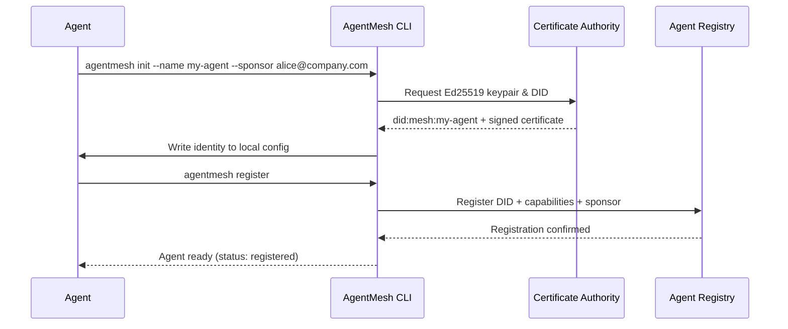
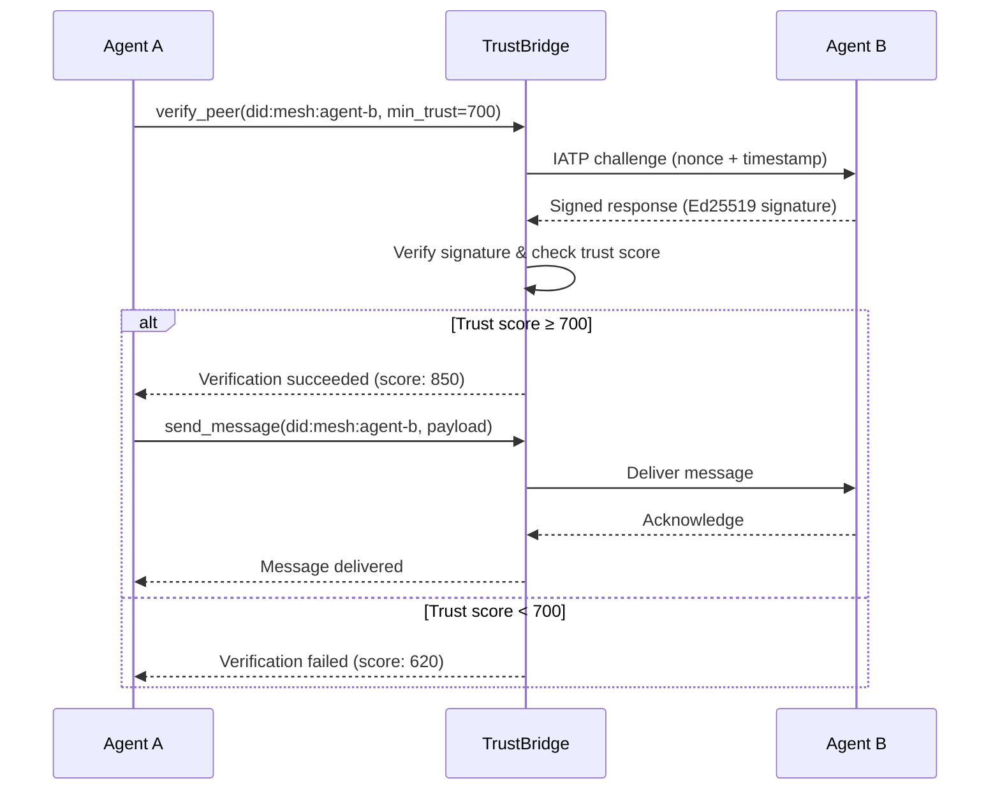
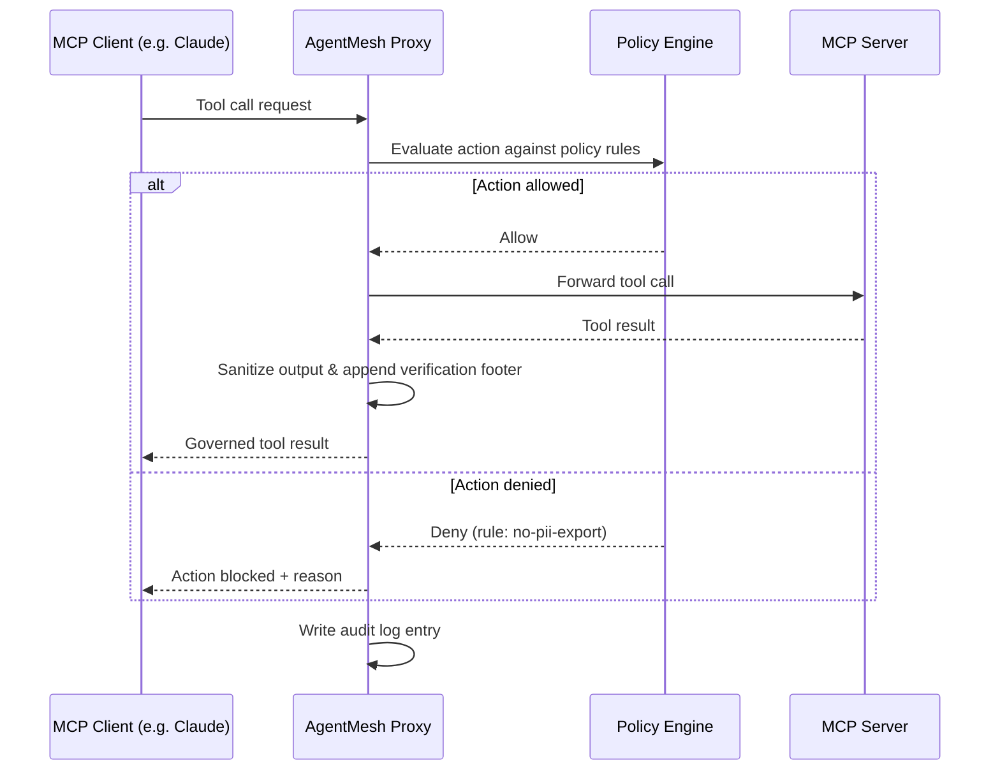
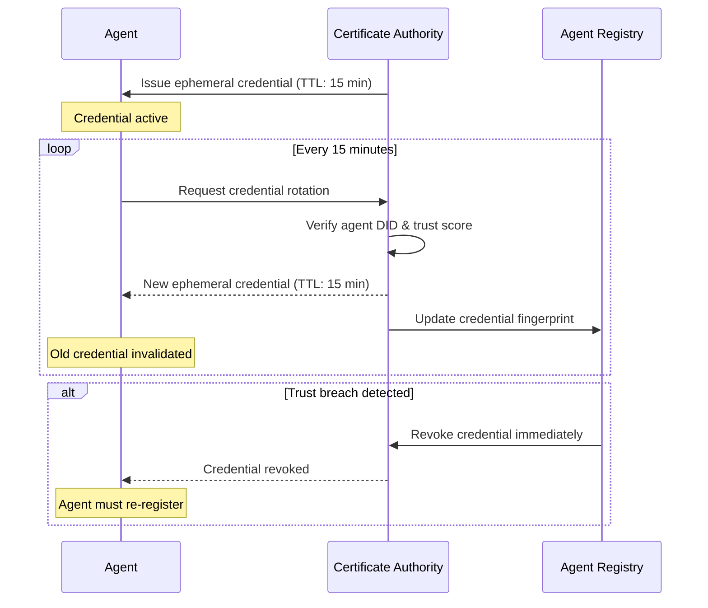
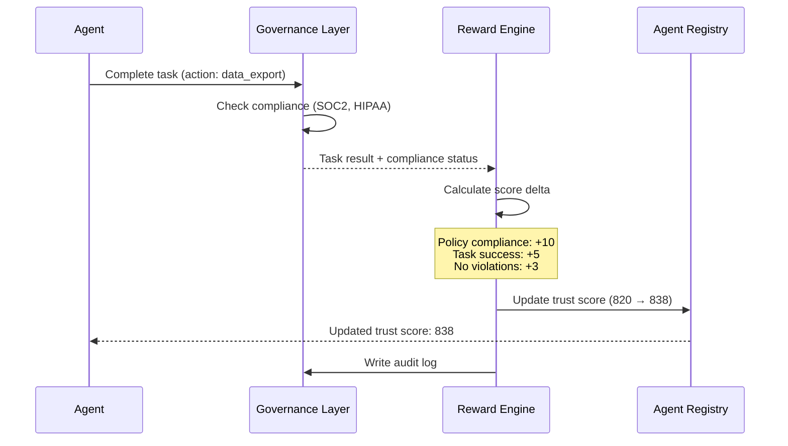

<div align="center">

# AgentMesh — Public Preview

**SSL for AI Agents**

*The trust, identity, and governance layer for production AI agent systems*

*Identity · Trust · Reward · Governance*

[](https://github.com/microsoft/agent-governance-toolkit/actions/workflows/ci.yml)
[](../../LICENSE)
[](https://python.org)
[](https://pypi.org/project/agentmesh-platform/)
[](https://github.com/Jenqyang/Awesome-AI-Agents/pull/45)
[](https://github.com/github/awesome-copilot/pull/755)
[](https://github.com/magsther/awesome-opentelemetry/pull/24)

> [!IMPORTANT]
> **Public Preview** — The `agentmesh-platform` package on PyPI is a Microsoft-signed
> public preview release. APIs may change before GA.

> ⭐ **If this project helps you, please star it!** It helps others discover AgentMesh.

> 🔗 **Part of the Agent Governance Ecosystem** — Works with [Agent OS](https://github.com/microsoft/agent-governance-toolkit) (kernel), [Agent Runtime](https://github.com/microsoft/agent-governance-toolkit) (runtime), and [Agent SRE](https://github.com/microsoft/agent-governance-toolkit) (reliability)

> 📦 **Install the full stack:** `pip install agent-governance-toolkit[full]` — [PyPI](https://pypi.org/project/ai-agent-governance/) | [GitHub](https://github.com/microsoft/agent-governance-toolkit)

[Quick Start](#quick-start) • [MCP Proxy](#the-agentmesh-proxy-ssl-for-ai-agents) • [Examples](#examples--integrations) • [Agent OS](https://github.com/microsoft/agent-governance-toolkit) • [Agent Runtime](https://github.com/microsoft/agent-governance-toolkit)

</div>

### Trusted By

<p align="center">
  <a href="https://github.com/langgenius/dify-plugins/pull/2060"></a>
  <a href="https://github.com/run-llama/llama_index/pull/20644"></a>
  <a href="https://github.com/microsoft/agent-governance-python/agent-lightning/pull/478"></a>
  <a href="https://pypi.org/project/langgraph-trust/"></a>
  <a href="https://pypi.org/project/openai-agents-trust/"></a>
  <a href="https://clawhub.ai/microsoft/agentmesh-governance"></a>
</p>

### Featured In

<p align="center">
  <a href="https://github.com/Shubhamsaboo/awesome-llm-apps"></a>
  <a href="https://github.com/Jenqyang/Awesome-AI-Agents/pull/45"></a>
  <a href="https://github.com/github/awesome-copilot/pull/755"></a>
  <a href="https://github.com/magsther/awesome-opentelemetry/pull/24"></a>
  <a href="https://github.com/heilcheng/awesome-agent-skills/pull/34"></a>
  <a href="https://github.com/TensorBlock/awesome-mcp-servers/pull/66"></a>
  <a href="https://github.com/rohitg00/awesome-devops-mcp-servers/pull/27"></a>
</p>

<table>
<tr>
<td align="center"><h3>1,669+</h3><sub>Tests Passing</sub></td>
<td align="center"><h3>6</h3><sub>Framework Integrations</sub></td>
<td align="center"><h3>170K+</h3><sub>Combined Stars of<br/>Integrated Projects</sub></td>
<td align="center"><h3>4</h3><sub>Protocol Bridges<br/>(A2A · MCP · IATP · AI Card)</sub></td>
<td align="center"><h3>&lt;1ms p99</h3><sub><a href="benchmarks/results/BENCHMARKS.md">Full Governance Pipeline</a></sub></td>
</tr>
</table>

### 🏢 Production Integrations

| Framework | Stars | Status | What We Ship |
|-----------|-------|--------|-------------|
| **Dify** | 65K ⭐ | ✅ Merged | Trust verification plugin in Dify Marketplace |
| **LlamaIndex** | 47K ⭐ | ✅ Merged | TrustedAgentWorker + TrustGatedQueryEngine |
| **Microsoft Agent-Lightning** | 15K ⭐ | ✅ Merged | Governance kernel for RL training safety |
| **LangGraph** | 24K ⭐ | 📦 PyPI | Trust-scored state transitions |
| **OpenAI Agents SDK** | — | 📦 PyPI | Tool-level governance guardrails |
| **Haystack** | 22K ⭐ | 🔄 In Review | GovernancePolicyChecker + TrustGate components |

> **AgentMesh is "SSL for AI Agents"** — the trust and identity layer that makes multi-agent systems enterprise-ready. Every agent gets a cryptographic identity. Every interaction is verified. Every action is audited.

---

<p align="center">
  
</p>

## Overview

AgentMesh is the first platform purpose-built for the **Governed Agent Mesh** — the cloud-native, multi-vendor network of AI agents that will define enterprise operations.

The protocols exist (A2A, MCP, IATP). The agents are shipping. **The trust layer does not.** AgentMesh fills that gap.

```
┌─────────────────────────────────────────────────────────────────────────────┐
│                           AGENTMESH ARCHITECTURE                            │
├─────────────────────────────────────────────────────────────────────────────┤
│  LAYER 4  │  Reward & Learning Engine                                       │
│           │  Per-agent trust scores · Behavioral rewards · Adaptive          │
├───────────┼─────────────────────────────────────────────────────────────────┤
│  LAYER 3  │  Governance & Compliance Plane                                  │
│           │  Policy engine · EU AI Act / SOC2 / HIPAA · Audit logs          │
├───────────┼─────────────────────────────────────────────────────────────────┤
│  LAYER 2  │  Trust & Protocol Bridge                                        │
│           │  A2A · MCP · IATP · Protocol translation · Capability scoping   │
├───────────┼─────────────────────────────────────────────────────────────────┤
│  LAYER 1  │  Identity & Zero-Trust Core                                     │
│           │  Agent CA · Ephemeral creds · SPIFFE/SVID · Human sponsors      │
│           │  Ed25519 + ML-DSA-65 (quantum-safe) · Lifecycle management      │
└───────────┴─────────────────────────────────────────────────────────────────┘
```

## Why AgentMesh?

### The Problem

- **40:1 to 100:1** — Non-human identities now outnumber human identities in enterprises
- **AI agents** are the fastest-growing, least-governed identity category
- **A2A gives agents a common language. MCP gives agents tools. Neither enforces trust.**

### The Solution

AgentMesh provides:

| Capability | Description |
|------------|-------------|
| **Agent Identity** | First-class identity with human sponsor accountability |
| **Quantum-Safe Signing** | Ed25519 + ML-DSA-65 (FIPS 204) post-quantum signatures |
| **Ephemeral Credentials** | 15-minute TTL by default, auto-rotation |
| **Lifecycle Management** | Provisioning → approval → activation → rotation → decommission |
| **Protocol Bridge** | Native A2A, MCP, IATP with unified trust model |
| **Reward Engine** | Continuous behavioral scoring |
| **Orphan Detection** | Find silent, unowned, and stale agents |
| **Compliance Automation** | EU AI Act, SOC 2, HIPAA, GDPR mapping |

## How It Works

### 1. Agent Registration & DID Issuance



### 2. Trust Handshake Between Two Agents



### 3. MCP Proxy Request Flow



### 4. Credential Rotation Lifecycle



### 5. Trust Score Update After Task Completion



## Quick Start

### Option 1: Secure Claude Desktop (Recommended)

```bash
# Install AgentMesh
pip install agentmesh-platform

# Set up Claude Desktop to use AgentMesh governance
agentmesh init-integration --claude

# Restart Claude Desktop - all MCP tools are now secured!
```

Claude will now route tool calls through AgentMesh for policy enforcement and trust scoring.

### Option 2: Create a Governed Agent

```bash
# Initialize a governed agent in 30 seconds
agentmesh init --name my-agent --sponsor alice@company.com

# Register with the mesh
agentmesh register

# Start with governance enabled
agentmesh run
```

### Option 3: Wrap Any MCP Server

```bash
# Proxy any MCP server with governance
agentmesh proxy --target npx --target -y \
  --target @modelcontextprotocol/server-filesystem \
  --target /path/to/directory

# Use strict policy (blocks writes/deletes)
agentmesh proxy --policy strict --target <your-mcp-server>
```

## Installation

```bash
pip install agentmesh-platform
```

Or install with extra dependencies:

```bash
pip install agentmesh-platform[server]  # FastAPI server
pip install agentmesh-platform[dev]     # Development tools
```

Or from source:

```bash
git clone https://github.com/microsoft/agent-governance-toolkit.git
cd agent-mesh
pip install -e .
```

## Examples & Integrations

**Real-world examples** to get started quickly:

| Example | Use Case | Key Features |
|---------|----------|--------------|
| [Registration Hello World](./examples/00-registration-hello-world/) | Agent registration walkthrough | Identity, DID, sponsor handshake |
| [MCP Tool Server](./examples/01-mcp-tool-server/) | Secure MCP server with governance | Rate limiting, output sanitization, audit logs |
| [Multi-Agent Customer Service](./examples/02-customer-service/) | Customer support automation | Trust handshakes, delegation, A2A |
| [Healthcare HIPAA](./examples/03-healthcare-hipaa/) | HIPAA-compliant data analysis | Compliance automation, PHI protection, audit logs |
| [DevOps Automation](./examples/04-devops-automation/) | Just-in-time DevOps credentials | Ephemeral creds, capability scoping |
| [GitHub PR Review](./examples/05-github-integration/) | Code review agent | Output policies, trust decay. Shadow mode has been moved to Agent SRE. |

**Framework integrations:**
- **[Claude Desktop](./docs/integrations/claude-desktop.md)** - Secure MCP tools with one command
- [LangChain Integration](./examples/integrations/langchain.md) - Secure LangChain agents with policies
- [CrewAI Integration](./examples/integrations/crewai.md) - Multi-agent crew governance
- [LangGraph](./src/agentmesh/integrations/langgraph/) - Trust checkpoints for graph workflows (built-in)
- [OpenAI Swarm](./src/agentmesh/integrations/swarm/) - Trust-verified handoffs (built-in)
- [Dify](https://github.com/microsoft/agent-governance-toolkit/tree/master/dify) - Trust middleware for Dify workflows

📚 **[Browse all examples →](./examples/)**

### Trust Visualization Dashboard

Interactive Streamlit dashboard:

```bash
cd examples/06-trust-score-dashboard
pip install -r requirements.txt
streamlit run trust_dashboard.py
```

Tabs: Trust Network | Trust Scores | Credential Lifecycle | Protocol Traffic | Compliance

## The AgentMesh Proxy: "SSL for AI Agents"

**Problem:** AI agents like Claude Desktop have unfettered access to your filesystem, database, and APIs through MCP servers. One hallucination could be catastrophic.

**Solution:** AgentMesh acts as a transparent governance proxy:

```bash
# Before: Unsafe direct access
{
  "mcpServers": {
    "filesystem": {
      "command": "npx",
      "args": ["-y", "@modelcontextprotocol/server-filesystem", "/Users/me"]
    }
  }
}

# After: Protected by AgentMesh
{
  "mcpServers": {
    "filesystem": {
      "command": "agentmesh",
      "args": [
        "proxy", "--policy", "strict",
        "--target", "npx", "--target", "-y",
        "--target", "@modelcontextprotocol/server-filesystem",
        "--target", "/Users/me"
      ]
    }
  }
}
```

**What you get:**
- 🔒 **Policy Enforcement** - Block dangerous operations before they execute
- 📊 **Trust Scoring** - Per-agent trust scoring (800-1000 scale)  
- 📝 **Audit Logs** - Record of every action
- ✅ **Verification Footers** - Visual confirmation in outputs

**Set it up in 10 seconds:**
```bash
agentmesh init-integration --claude
# Restart Claude Desktop - done!
```

Learn more: **[Claude Desktop Integration Guide](./docs/integrations/claude-desktop.md)**

## Core Concepts

### 1. Agent Identity

Every agent gets a unique, cryptographically bound identity:

```python
from agentmesh import AgentIdentity

identity = AgentIdentity.create(
    name="data-analyst-agent",
    sponsor="alice@company.com",  # Human accountability
    capabilities=["read:data", "write:reports"],
)
```

### 2. Scope Chains

Agents can delegate to sub-agents, but scope **always narrows**:

```python
# Parent agent delegates to child
child_identity = parent_identity.delegate(
    name="summarizer-subagent",
    capabilities=["read:data"],  # Subset of parent's capabilities
)
```

### 3. Trust Handshakes (IATP)

Cross-agent communication requires trust verification:

```python
from agentmesh import AgentIdentity, TrustBridge

# Create your identity first
identity = AgentIdentity.create(name="my-agent", sponsor="admin@company.com")

# Set up trust bridge
bridge = TrustBridge(agent_did=str(identity.did))

# Verify peer before communication
verification = await bridge.verify_peer(
    peer_did="did:mesh:other-agent",
    required_trust_score=700,
)

if verification.verified:
    print(f"Peer trusted: score={verification.trust_score}")
```

### 4. Reward Scoring

Every action is scored to maintain agent trust:

```python
from agentmesh import RewardEngine

engine = RewardEngine()

# Actions are automatically scored
score = engine.get_agent_score("did:mesh:my-agent")
# Returns trust score on 0-1000 scale
```

### 5. Policy Engine

Declarative governance policies:

```yaml
# policy.yaml
version: "1.0"
agent: "data-analyst-agent"

rules:
  - name: "no-pii-export"
    condition: "action.type == 'export' and data.contains_pii"
    action: "deny"
    
  - name: "rate-limit-api"
    condition: "action.type == 'api_call'"
    limit: "100/hour"
    
  - name: "require-approval-for-delete"
    condition: "action.type == 'delete'"
    action: "require_approval"
    approvers: ["security-team"]
```

## Protocol Support

| Protocol | Status | Description |
|----------|--------|-------------|
| AI Card | ✅ Alpha | Cross-protocol identity standard (`src/agentmesh/integrations/ai_card/`) |
| A2A | ✅ Alpha | Agent-to-agent coordination (full adapter in `src/agentmesh/integrations/a2a/`) |
| MCP | ✅ Alpha | Tool and resource binding (trust-gated server/client in `src/agentmesh/integrations/mcp/`) |
| IATP | ✅ Alpha | Trust handshakes (via [agent-os](https://github.com/microsoft/agent-governance-toolkit), graceful fallback if unavailable) |
| ACP | 🔜 Planned | Lightweight messaging (protocol bridge supports routing, adapter not yet implemented) |
| SPIFFE | ✅ Alpha | Workload identity |

## Architecture

```
agentmesh/
├── identity/           # Layer 1: Identity & Zero-Trust
│   ├── agent_id.py     # Agent identity management (DIDs, Ed25519 keys)
│   ├── credentials.py  # Ephemeral credential issuance (15-min TTL)
│   ├── delegation.py   # Scope chains
│   ├── spiffe.py       # SPIFFE/SVID integration
│   ├── risk.py         # Continuous risk scoring
│   └── sponsor.py      # Human sponsor accountability
│
├── trust/              # Layer 2: Trust & Protocol Bridge
│   ├── bridge.py       # Multi-protocol trust bridge (A2A/MCP/IATP/ACP)
│   ├── handshake.py    # IATP trust handshakes
│   ├── cards.py        # Trusted agent cards
│   └── capability.py   # Capability scoping
│
├── governance/         # Layer 3: Governance & Compliance
│   ├── policy.py       # Declarative policy engine (YAML/JSON)
│   ├── compliance.py   # Compliance mapping (EU AI Act, SOC2, HIPAA, GDPR)
│   ├── eu_ai_act.py    # EU AI Act risk classifier (Art. 5/6, Annex I/III)
│   ├── audit.py        # Audit logs
│   └── shadow.py       # Legacy reference. Shadow mode has been moved to Agent SRE.
│
├── reward/             # Layer 4: Reward & Learning
│   ├── engine.py       # Multi-dimensional reward engine
│   ├── scoring.py      # Trust scoring
│   └── learning.py     # Adaptive learning
│
├── integrations/       # Protocol & framework adapters
│   ├── ai_card/        # AI Card standard (cross-protocol identity)
│   ├── a2a/            # Google A2A protocol support
│   ├── mcp/            # Anthropic MCP trust-gated server/client
│   ├── langgraph/      # LangGraph trust checkpoints
│   └── swarm/          # OpenAI Swarm trust-verified handoffs
│
├── cli/                # Command-line interface
│   ├── main.py         # agentmesh init/register/status/audit/policy
│   └── proxy.py        # MCP governance proxy
│
├── core/               # Low-level services
│   └── identity/ca.py  # Certificate Authority (SPIFFE/SVID)
│
├── storage/            # Storage abstraction (memory, Redis, PostgreSQL)
│
├── observability/      # OpenTelemetry tracing & Prometheus metrics
│
└── services/           # Service wrappers (registry, audit, reward)
```

## Compliance

AgentMesh automates compliance mapping for:

- **EU AI Act** — Structured risk classification (Art. 5/6, Annex I/III, Art. 6(3) exemptions)
- **SOC 2** — Security, availability, processing integrity
- **HIPAA** — PHI handling, audit controls
- **GDPR** — Data processing, consent, right to explanation

```python
from agentmesh import ComplianceEngine, ComplianceFramework

compliance = ComplianceEngine(frameworks=[ComplianceFramework.SOC2, ComplianceFramework.HIPAA])

# Check an action for violations
violations = compliance.check_compliance(
    agent_did="did:mesh:healthcare-agent",
    action_type="data_access",
    context={"data_type": "phi", "encrypted": True},
)

# Generate compliance report
from datetime import datetime, timedelta
report = compliance.generate_report(
    framework=ComplianceFramework.SOC2,
    period_start=datetime.utcnow() - timedelta(days=30),
    period_end=datetime.utcnow(),
)
```

### EU AI Act Risk Classification

```python
from agentmesh.governance import EUAIActRiskClassifier, AgentRiskProfile

classifier = EUAIActRiskClassifier()

# Classify a credit-scoring system
profile = AgentRiskProfile(
    name="CreditBot",
    domain="credit_scoring",
    capabilities=["financial_decisioning"],
)
result = classifier.classify(profile)
print(result.risk_level)   # RiskLevel.HIGH
print(result.triggers)     # ["Domain 'credit_scoring' listed in Annex III (high-risk)"]

# Art. 6(3) exemption for a narrow procedural task
profile = AgentRiskProfile(
    name="FormHelper",
    domain="employment_recruitment",
    exemption_tags=["narrow_procedural_task"],
)
result = classifier.classify(profile)
print(result.risk_level)          # Not HIGH (exempted)
print(result.exemptions_applied)  # ["narrow_procedural_task"]

# Custom config for regulatory updates
classifier = EUAIActRiskClassifier(config_path="my_updated_annex_iii.yaml")
```

## Threat Model

| Threat | AgentMesh Defense |
|--------|-------------------|
| Prompt Injection | Tool output sanitized at Protocol Bridge |
| Credential Theft | 15-min TTL, instant revocation on trust breach |
| Shadow Agents | Unregistered agents blocked at network layer |
| Delegation Escalation | Chains enforce scope narrowing |
| Cascade Failure | Per-agent trust scoring isolates blast radius |

## 🗺️ Roadmap

| Quarter | Milestone |
|---------|-----------|
| **Q1 2026** | ✅ Core trust layer, identity, governance engine, 6 framework integrations |
| **Q2 2026** | ✅ TypeScript package, Go module, lifecycle management, quantum-safe ML-DSA-65 signing, governance dashboard |
| **Q3 2026** | AI Card spec contribution, CNCF Sandbox application |
| **Q4 2026** | Managed cloud service (AgentMesh Cloud), SOC2 Type II |

See our [full roadmap](docs/roadmap.md) for details.

## Known Limitations & Open Work

> Transparency about what's done and what isn't.

### Not Yet Implemented

| Item | Location | Notes |
|------|----------|-------|
| ACP protocol adapter | `trust/bridge.py` | Bridge routes ACP messages, but no dedicated `ACPAdapter` class yet |
| Service wrapper for audit | `services/audit/` | Core audit module (`governance/audit.py`) is complete; service layer wrapper is a TODO |
| Service wrapper for reward engine | `services/reward_engine/` | Core reward engine (`reward/engine.py`) is complete; service layer wrapper is a TODO |
| Mesh control plane | `services/mesh-control-plane/` | Placeholder directory; no implementation yet |
| Scope chain cryptographic verification | `agent-governance-python/agent-mesh/packages/langchain-agentmesh/trust.py` | Simulated verification; full cryptographic chain validation not yet implemented |

### Integration Caveats (Dify)

The [Dify integration](https://github.com/microsoft/agent-governance-toolkit/tree/master/dify) has these documented limitations:
- Request body signature verification (`X-Agent-Signature` header) is not yet verified by middleware
- Trust score time decay is not yet implemented (scores don't decay over time)
- Audit logs are in-memory only (not persistent across multi-worker deployments)
- Environment variable configuration requires programmatic initialization (not auto-wired)

### Infrastructure

- **Redis/PostgreSQL storage providers**: Implemented but require real infrastructure for testing (unit tests use in-memory provider)
- **Kubernetes Operator**: GovernedAgent CRD defined, but no controller/operator to reconcile it
- **SPIRE Integration**: SPIFFE identity module exists; real SPIRE agent integration is stubbed
- **Performance targets**: Latency overhead (<5ms) and throughput (10k reg/sec) are design targets, not yet benchmarked

### Documentation

- `docs/rfcs/` — Directory exists, no RFCs written yet
- `docs/architecture/` — Directory exists, no architecture docs yet (see `IMPLEMENTATION-NOTES.md` for current notes)

## Dependencies

AgentMesh builds on:

- **[Agent OS](https://github.com/microsoft/agent-governance-toolkit)** — IATP protocol, Nexus trust exchange
- **[Agent Runtime](https://github.com/microsoft/agent-governance-toolkit)** — Runtime session governance
- **[Agent SRE](https://github.com/microsoft/agent-governance-toolkit)** — SLO monitoring, chaos testing
- **SPIFFE/SPIRE** — Workload identity
- **OpenTelemetry** — Observability

## Frequently Asked Questions

**What is an agent mesh?**
An agent mesh is a trust and communication infrastructure for multi-agent AI systems, analogous to a service mesh for microservices. AgentMesh provides identity (DID-based), per-agent trust scoring (0-1000 scale), ephemeral credentials, reward distribution, and automated compliance mapping.

**How does AgentMesh handle trust between agents?**
Every agent gets a trust score from 0 to 1000 based on behavioral history, vouching from other agents, and compliance with governance policies. Trust scores gate what actions agents can perform and which sessions they can join. The score updates in real-time based on agent behavior.

**What protocols does AgentMesh bridge?**
AgentMesh unifies three major protocols: Google's A2A (Agent-to-Agent) for inter-agent communication, Anthropic's MCP (Model Context Protocol) for tool integration, and IATP (Inter-Agent Trust Protocol) for cryptographic trust establishment. This means agents built on different frameworks can communicate through a single trust-verified channel.

**Does AgentMesh help with regulatory compliance?**
Yes. AgentMesh provides automated compliance mapping for EU AI Act, SOC 2, HIPAA, and GDPR. Combined with audit trails and deterministic policy enforcement from [Agent OS](https://github.com/microsoft/agent-governance-toolkit), it provides the documentation and safety guarantees needed for regulatory compliance.

## Contributing

See [CONTRIBUTING.md](CONTRIBUTING.md) for guidelines.

## License

MIT — See [LICENSE](LICENSE) for details.

---

**Agents shouldn't be islands. But they also shouldn't be ungoverned.**

*AgentMesh is the trust layer that makes the mesh safe enough to scale.*
