# 🛡️ Agent OS - Safe Mode Demos

> **"Your AI agent tried to `rm -rf`. We said no."**



Visual demos showing Agent OS blocking dangerous AI agent operations in real-time.

## 🎬 Available Demos

| Demo | Framework | What It Shows |
|------|-----------|---------------|
| `crewai_safe_mode.py` | CrewAI | Multi-agent crew safety |
| `langchain_safe_mode.py` | LangChain | Tool call governance |

## 🚀 Quick Start

```bash
# Clone and run (no dependencies needed!)
git clone https://github.com/microsoft/agent-governance-toolkit
cd agent-governance-python/agent-os/examples/crewai-safe-mode

# CrewAI demo
python crewai_safe_mode.py

# LangChain demo
python langchain_safe_mode.py
```

## 📹 Record for Social Media

```bash
# Windows: Win+G (Game Bar)
# macOS: Cmd+Shift+5
# Linux: Peek, SimpleScreenRecorder
```

**Key frames for your 15s GIF:**
1. Agent OS banner
2. Agent trying dangerous operation
3. 🚫 **ACCESS DENIED** banner (the money shot!)
4. Statistics: "Blocked: 5, Allowed: 2"

---

## 📋 Outreach Templates

### 🚢 CrewAI

#### Forum Post

**Title:** "I built a Safety Kernel for Crews"

```markdown
Hey CrewAI community! 👋

I've been working on a kernel-level safety layer for autonomous agents
called Agent OS. It intercepts dangerous operations (file deletion,
privilege escalation, etc.) BEFORE they execute.

Just made a demo specifically for CrewAI:
🔗 https://github.com/microsoft/agent-governance-toolkit/tree/main/examples/crewai-safe-mode

What it does:
- Wraps your CrewAI agents in a safety kernel
- Blocks operations like `rm -rf`, `sudo`, `chmod 777`
- Maintains full audit log of all agent actions
- Zero code changes to your existing crews

Run it yourself:
git clone https://github.com/microsoft/agent-governance-toolkit
cd agent-governance-python/agent-os/examples/crewai-safe-mode
python crewai_safe_mode.py

Would love feedback!
```

#### Tweet to João Moura (@joaomdmoura)

```
Hey @joaomdmoura, love CrewAI! 🚀

I built a kernel-level safety layer to stop agents from hallucinating
dangerous file ops (POSIX-style permissions).

Demo for CrewAI: https://github.com/microsoft/agent-governance-toolkit/tree/main/examples/crewai-safe-mode

Would love to contribute this as a 'Safety Adapter' for enterprise crews! 🛡️

[Attach GIF]
```

#### PR to crewAI-examples

**Title:** `feat: Add Agent OS safety governance example`

---

### 🦜 LangChain

#### Forum Discussion

**Title:** "Proposal: Kernel-level Governance for LangChain Agents"

```markdown
Hi LangChain community! 👋

I've built a middleware called Agent OS that provides kernel-level
process control and safety for LangChain agents.

## The Problem
Agents with tools can:
- Execute destructive SQL (DROP TABLE)
- Access shell (rm -rf)
- Delete files accidentally

## The Solution
Agent OS wraps tool execution with safety policies:
- Block dangerous tools by default
- Pattern-match dangerous inputs
- Full audit logging
- Zero code changes

Demo: https://github.com/microsoft/agent-governance-toolkit/tree/main/examples/crewai-safe-mode

python langchain_safe_mode.py

Would love feedback on what tools should be blocked by default!
```

#### PyPI Package (`langchain-agent-os`)

Coming soon - a seamless integration:

```python
from langchain.agents import AgentExecutor
from langchain_agent_os import AgentOSMiddleware

safe_agent = AgentOSMiddleware(agent_executor, policy="strict")
safe_agent.invoke({"input": "Do something"})
```

---

## 📁 Files

| File | Description |
|------|-------------|
| `crewai_safe_mode.py` | CrewAI demo (standalone) |
| `langchain_safe_mode.py` | LangChain demo (standalone) |
| `demo.svg` | Animated SVG for README/social |
| `demo.tape` | VHS script (for Linux/WSL GIF recording) |
| `README.md` | This file |
