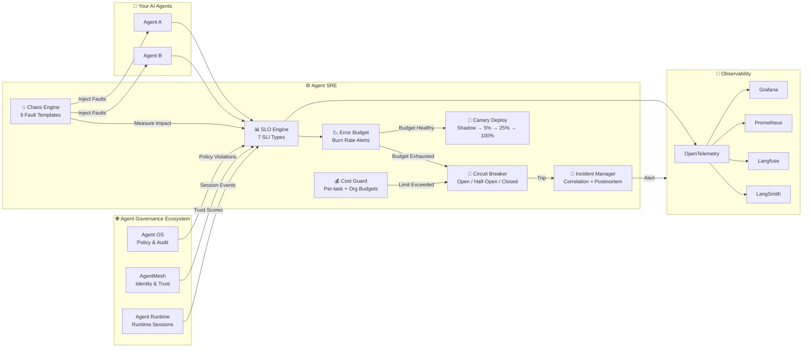

<div align="center">

# Agent SRE

**Reliability Engineering for AI Agent Systems**

*SLOs · Error Budgets · Chaos Testing · Progressive Delivery · Cost Guardrails*

[](https://github.com/microsoft/agent-governance-toolkit/actions/workflows/ci.yml)
[](../../LICENSE)
[](https://python.org)
[](https://pypi.org/project/agent-governance-python/agent-sre/)

> [!IMPORTANT]
> **Public Preview** — The `agent-sre` package on PyPI is a Microsoft-signed
> public preview release. APIs may change before GA.

> ⭐ **If this project helps you, please star it!** It helps others discover Agent SRE.

> 🔗 **Part of the [Agent Governance Ecosystem](https://github.com/microsoft/agent-governance-toolkit)** — Works with [Agent OS](https://github.com/microsoft/agent-governance-toolkit) (governance), [AgentMesh](https://github.com/microsoft/agent-governance-toolkit) (identity & trust), and [Agent Runtime](https://github.com/microsoft/agent-governance-toolkit) (runtime sessions)

> 📦 **Install the full stack:** `pip install agent-governance-toolkit[full]` — [PyPI](https://pypi.org/project/ai-agent-governance/) | [GitHub](https://github.com/microsoft/agent-governance-toolkit)

[Quick Start](#-quick-start-in-30-seconds) • [Architecture](#-architecture-diagram) • [Examples](examples/) • [Benchmarks](benchmarks/results/BENCHMARKS.md) • [Docs](docs/) • [Agent OS](https://github.com/microsoft/agent-governance-toolkit) • [AgentMesh](https://github.com/microsoft/agent-governance-toolkit) • [Agent Runtime](https://github.com/microsoft/agent-governance-toolkit)

</div>

### Trusted By — Part of the AgentMesh Governance Ecosystem

<p align="center">
  <a href="https://github.com/langgenius/dify-plugins/pull/2060"></a>
  <a href="https://github.com/run-llama/llama_index/pull/20644"></a>
  <a href="https://github.com/microsoft/agent-governance-python/agent-lightning/pull/478"></a>
  <a href="https://pypi.org/project/langgraph-trust/"></a>
  <a href="https://pypi.org/project/openai-agents-trust/"></a>
  <a href="https://clawhub.ai/microsoft/agentmesh-governance"></a>
</p>

Reliability layer across **170K+ combined GitHub stars** of integrated projects — [Dify](https://github.com/langgenius/dify-plugins/pull/2060) (65K ⭐), [LlamaIndex](https://github.com/run-llama/llama_index/pull/20644) (47K ⭐), [Agent-Lightning](https://github.com/microsoft/agent-governance-python/agent-lightning/pull/478) (15K ⭐), [LangGraph](https://pypi.org/project/langgraph-trust/), [OpenAI Agents](https://pypi.org/project/openai-agents-trust/), and [OpenClaw](https://clawhub.ai/microsoft/agentmesh-governance).

---

## 📊 By The Numbers

<table>
<tr>
<td align="center"><h3>1,257+</h3><sub>Tests Passing</sub></td>
<td align="center"><h3>12+</h3><sub>Framework Adapters<br/><sub>LangChain · CrewAI · AutoGen<br/>LangGraph · Dify · more</sub></sub></td>
<td align="center"><h3>13</h3><sub>Observability Platforms<br/><sub>Langfuse · LangSmith · Arize<br/>Datadog · Prometheus · PagerDuty<br/>Grafana · OTel · more</sub></sub></td>
<td align="center"><h3>OpenTelemetry</h3><sub>Native OTLP Export</sub></td>
</tr>
<tr>
<td align="center"><h3>7</h3><sub>SRE Engines</sub></td>
<td align="center"><h3>9</h3><sub>Chaos Fault Templates</sub></td>
<td align="center"><h3>7</h3><sub>SLI Types</sub></td>
<td align="center"><h3>100%</h3><sub>Test Coverage<br/>on Core Engines</sub></td>
</tr>
</table>

### 💡 Why Agent SRE?

> **The problem:** AI agents fail silently, have no error budgets, and cascading failures propagate unchecked. Your APM says "HTTP 200, all green" while your agent just approved a fraudulent transaction.

> **Our solution:** Apply proven SRE principles to AI agents — SLOs, error budgets, chaos testing, and circuit breakers. The same discipline that keeps Google, Netflix, and Spotify reliable, adapted for non-deterministic agent workloads.

**Built for the $47B AI agent market** — the reliability layer that makes autonomous agents production-ready.

### 🛡️ OWASP Agentic Security Coverage

Agent SRE directly addresses **[OWASP Agentic Security Initiative](https://github.com/microsoft/agent-governance-toolkit/blob/master/docs/owasp-agentic-top10-mapping.md)** risk **ASI08 — Cascading Failures**:

| OWASP Risk | Agent SRE Coverage |
|---|---|
| **ASI08: Cascading Failures** | Circuit breakers, error budgets, fault isolation, chaos testing to prove resilience |
| **ASI07: Uncontrolled Costs** | Per-task cost limits, org budgets, anomaly detection, auto-throttle, kill switch |
| **ASI09: Lack of Observability** | 7 SLI types, OpenTelemetry export, 11 observability platform integrations |
| **ASI10: Inadequate Testing** | Chaos engineering with 9 fault templates, progressive delivery with shadow & canary |

> See full [OWASP Agentic Top 10 mapping →](https://github.com/microsoft/agent-governance-toolkit/blob/master/docs/owasp-agentic-top10-mapping.md)

---

## 🏗️ Architecture Diagram



---

## ⚡ Quick Start in 30 Seconds

```bash
pip install agent-sre
```

```python
from agent_sre import SLO, ErrorBudget
from agent_sre.slo.indicators import TaskSuccessRate, CostPerTask, HallucinationRate

# Define what "reliable" means for your agent
slo = SLO(
    name="my-agent",
    indicators=[
        TaskSuccessRate(target=0.95, window="24h"),
        CostPerTask(target_usd=0.50, window="24h"),
        HallucinationRate(target=0.05, window="24h"),
    ],
    error_budget=ErrorBudget(total=0.05),
)

# After each agent task
slo.indicators[0].record_task(success=True)
slo.indicators[1].record_cost(cost_usd=0.35)
slo.indicators[2].record_evaluation(hallucinated=False)
slo.record_event(good=True)

# Check health
status = slo.evaluate()  # HEALTHY, WARNING, CRITICAL, or EXHAUSTED
print(f"Budget remaining: {slo.error_budget.remaining_percent:.1f}%")
```

That's it. Your agent now has SLOs, error budgets, and burn rate alerts. [See all examples →](examples/)

---

## The Problem

AI agents in production fail differently than traditional services:

| Failure Mode | Traditional Service | AI Agent |
|---|---|---|
| **Crash** | Stack trace, restart | Same — but rare |
| **Wrong answer** | N/A | Returns "success" but the answer is wrong |
| **Silent degradation** | Latency spike | Reasoning quality drops, no metric moves |
| **Cost explosion** | Predictable | Runaway tool loops burn $10K in minutes |
| **Cascade failure** | Service A → B | Agent A trusts Agent B who hallucinates |
| **Tool drift** | API versioning | MCP server schema changes silently break workflows |

Your APM dashboard says "HTTP 200, latency 150ms, all green" while your agent just approved a fraudulent transaction.

**Traditional monitoring catches crashes. Agent SRE catches *everything else*.**

## The Solution

Agent SRE brings Site Reliability Engineering to AI agents — the same discipline that keeps Google, Netflix, and Spotify reliable, adapted for non-deterministic agent workloads.

```
┌─────────────────────────────────────────────────────────────────┐
│                      Your AI Agents                             │
├─────────────────────────────────────────────────────────────────┤
│  Agent SRE — The Reliability Lifecycle                          │
│                                                                 │
│  1. DEFINE    SLOs — what does "reliable" mean?                  │
│  2. MEASURE   SLIs — are we meeting those targets?              │
│  3. PROTECT   Cost Guard + Circuit Breaker — prevent disasters  │
│  4. SHIP      Shadow + Canary — deploy changes safely           │
│  5. BREAK     Chaos Engine — prove resilience before prod does  │
│  6. RESPOND   Incidents + Postmortem — recover fast             │
│  7. LEARN     Replay + Diff — understand exactly what happened  │
├─────────────────────────────────────────────────────────────────┤
│  AgentMesh — Identity, Trust, Routing                           │
├─────────────────────────────────────────────────────────────────┤
│  Agent OS — Policy Enforcement, Audit, Compliance               │
└─────────────────────────────────────────────────────────────────┘
```

---

## Core Capabilities

### 1. SLO Engine — Define What "Reliable" Means

Traditional SRE defines SLOs for services (99.9% uptime). Agent SRE defines SLOs for *agent behavior*:

| SLI (Indicator) | Example SLO | What It Catches |
|---|---|---|
| **Task Success Rate** | 99.5% of tasks correct | Silent reasoning failures |
| **Tool Call Accuracy** | 99.9% correct tool selection | Wrong tool, wrong arguments |
| **Response Latency (P95)** | < 5s single-step | Stuck in reasoning loops |
| **Cost Per Task** | < $0.50 mean | Runaway tool loops |
| **Policy Compliance** | 100% adherence | Safety violations |
| **Scope Chain Depth** | ≤ 3 hops | Unbounded delegation |
| **Hallucination Rate** | < 1% factual errors | Confident wrong answers |

```python
from agent_sre import SLO, ErrorBudget
from agent_sre.slo.indicators import TaskSuccessRate, CostPerTask, HallucinationRate

slo = SLO(
    name="customer-support-agent",
    indicators=[
        TaskSuccessRate(target=0.995, window="30d"),
        CostPerTask(target_usd=0.50, window="24h"),
        HallucinationRate(target=0.05, window="24h"),
    ],
    error_budget=ErrorBudget(
        total=0.005,
        burn_rate_alert=2.0,      # Alert at 2x normal burn
        burn_rate_critical=10.0,  # Page at 10x burn
    )
)

slo.record_event(good=True)
status = slo.evaluate()  # HEALTHY | WARNING | CRITICAL | EXHAUSTED
```

### 2. Replay Engine — Time-Travel Debugging for Agents

Capture every decision point and replay it exactly:

```python
from agent_sre.replay.capture import TraceCapture, SpanKind, TraceStore

# Capture mode: records all decisions, tool calls, costs
with TraceCapture(agent_id="support-bot-v3", task_input="Refund order #12345") as capture:
    span = capture.start_span("tool_call", SpanKind.TOOL_CALL,
                              input_data={"tool": "lookup_order", "order_id": "12345"})
    span.finish(output={"status": "found", "amount": 49.99}, cost_usd=0.02)

    span = capture.start_span("llm_inference", SpanKind.LLM_INFERENCE,
                              input_data={"prompt": "Process refund for $49.99"})
    span.finish(output={"decision": "approve_refund"}, cost_usd=0.15)

# Save trace, replay later, diff with production
store = TraceStore()
store.save(capture.trace)
```

Features: deterministic replay, trace diffing, what-if analysis, multi-agent distributed traces, automatic PII redaction.

### 3. Progressive Delivery — Ship Agent Changes Safely

```yaml
# agent-sre.yaml — GitOps deployment spec
apiVersion: agent-governance-python/agent-sre/v1
kind: AgentRollout
metadata:
  name: support-bot-v4
spec:
  strategy:
    type: canary
    steps:
      - shadow: 100%     # Route all traffic to v4 in preview mode
        duration: 1h
        analysis:
          - metric: task_success_rate
            threshold: 0.99
      - canary: 5%        # 5% real traffic to v4
        duration: 2h
        analysis:
          - metric: response_quality_score
            threshold: 0.95
          - metric: cost_per_task
            max_increase: 20%
      - canary: 25%
        duration: 4h
      - canary: 100%      # Full rollout
    rollback:
      automatic: true
      on:
        - error_budget_burn_rate > 5.0
        - policy_violations > 0
        - cost_anomaly_detected
```

### 4. Chaos Engineering — Break Agents on Purpose

```python
from agent_sre.chaos.engine import ChaosExperiment, Fault, AbortCondition

experiment = ChaosExperiment(
    name="tool-failure-resilience",
    target_agent="research-agent",
    faults=[
        Fault.tool_timeout("web_search", delay_ms=30_000),
        Fault.tool_error("database_query", error="connection_refused", rate=0.5),
        Fault.llm_latency("openai", p99_ms=15_000),
        Fault.delegation_reject("analyzer", rate=0.1),
    ],
    duration_seconds=1800,
    abort_conditions=[
        AbortCondition(metric="task_success_rate", threshold=0.80, comparator="lte"),
        AbortCondition(metric="cost_per_task", threshold=5.00, comparator="gte"),
    ],
)

experiment.start()
for fault in experiment.faults:
    experiment.inject_fault(fault, applied=True)

resilience = experiment.calculate_resilience(
    baseline_success_rate=0.98,
    experiment_success_rate=0.88,
    recovery_time_ms=2500,
)
print(f"Fault Impact Score: {resilience.overall:.0f}/100")
```

9 pre-built experiment templates: tool timeout, error storms, LLM degradation, cascading failures, cost explosions, and more.

### 5. Cost Guard — Prevent $10K Surprises

```python
from agent_sre.cost.guard import CostGuard

guard = CostGuard(
    per_task_limit=2.00,          # Hard cap per task
    per_agent_daily_limit=100.00, # Per agent per day
    org_monthly_budget=5000.00,   # Organization total
    anomaly_detection=True,       # Alert on unusual patterns
    auto_throttle=True,           # Slow down agents approaching limits
    kill_switch_threshold=0.95,   # Kill at 95% budget
)

# Before each task
allowed, reason = guard.check_task("my-agent", estimated_cost=0.50)
if not allowed:
    print(f"Blocked: {reason}")

# After each task
alerts = guard.record_cost("my-agent", "task-42", cost_usd=0.35)
for alert in alerts:
    print(f"⚠️ {alert.severity.value}: {alert.message}")
```

Anomaly detection uses Z-score, IQR, and EWMA methods with severity scoring.

### 6. Incident Manager — When Agents Fail in Production

```python
from agent_sre.incidents.detector import IncidentDetector, Signal, SignalType

detector = IncidentDetector(correlation_window_seconds=300)

# Register automated responses
detector.register_response("slo_breach", ["manual_rollback", "notify_oncall"])
detector.register_response("cost_anomaly", ["throttle_agent", "create_postmortem_template"])

# Ingest signals from your monitoring
signal = Signal(
    signal_type=SignalType.ERROR_BUDGET_EXHAUSTED,
    source="support-agent",
    message="Error budget consumed — freeze deployments",
)

incident = detector.ingest_signal(signal)
if incident:
    print(f"🚨 {incident.severity.value}: {incident.title}")
```

Features: signal correlation, deduplication, circuit breaker per agent, automated runbook execution, postmortem generation with timeline and action items.

---

## Ecosystem Integration

Agent SRE completes the governance-to-reliability stack:

| Layer | Project | What It Does |
|---|---|---|
| **Reliability** | **Agent SRE** (this) | SLOs, chaos testing, canary deploys, cost guard, replay |
| **Runtime** | [Agent Runtime](https://github.com/microsoft/agent-governance-toolkit) | Session isolation, execution rings, saga orchestration |
| **Networking** | [AgentMesh](https://github.com/microsoft/agent-governance-toolkit) | Identity, trust, routing, delegation |
| **Kernel** | [Agent OS](https://github.com/microsoft/agent-governance-toolkit) | Policy enforcement, audit, compliance |

### With Agent OS
- Policy violations → SLO breaches (every violation counts against error budget)
- Audit trail → Replay engine (raw data for deterministic replay)
- Preview mode → Progressive delivery pipeline

### With AgentMesh
- Trust scores → SLI indicators (mesh trust becomes an SLI)
- Scope chains → Distributed traces (every hop is a span)
- Identity rotation → Deployment events (tracked as reliability events)

### With OpenTelemetry
- Native OTLP export for all SLIs and traces
- Custom semantic conventions for agent-specific telemetry
- Compatible with Grafana, Prometheus, Jaeger, and other OTLP-compatible backends

---

## Architecture

```
agent-governance-python/agent-sre/
├── src/agent_sre/
│   ├── slo/               # SLO definitions, SLI collectors, error budgets
│   │   ├── indicators.py  # 7 built-in SLIs (task success, cost, hallucination, etc.)
│   │   ├── objectives.py  # SLO engine with burn rate alerts
│   │   └── dashboard.py   # SLO dashboard with compliance history
│   ├── replay/            # Deterministic capture and replay engine
│   │   ├── capture.py     # Trace capture with PII redaction
│   │   ├── engine.py      # Replay, diff, trace comparison
│   │   ├── visualization.py  # Execution graphs, critical path
│   │   └── distributed.py # Multi-agent trace reconstruction
│   ├── delivery/          # Progressive delivery (shadow, canary, rollback)
│   │   ├── rollout.py     # Preview mode, staged rollouts, traffic splitting
│   │   └── gitops.py      # Declarative rollout specs (YAML)
│   ├── chaos/             # Chaos engineering and fault injection
│   │   ├── engine.py      # Experiment state machine, fault impact scoring
│   │   └── library.py     # 9 pre-built experiment templates
│   ├── cost/              # Cost tracking, budgets, anomaly detection
│   │   ├── guard.py       # Hierarchical budgets, auto-throttle, kill switch
│   │   └── anomaly.py     # Z-score, IQR, EWMA anomaly detection
│   ├── incidents/         # Detection, response, postmortem generation
│   │   ├── detector.py    # Signal correlation, deduplication, routing
│   │   ├── circuit_breaker.py  # Per-agent circuit breaker (CLOSED/OPEN/HALF_OPEN)
│   │   └── postmortem.py  # Postmortem template with timeline + action items
│   ├── integrations/      # Ecosystem bridges
│   │   ├── agent_os/      # Agent OS policy + audit → SLI bridge
│   │   ├── agent_mesh/    # AgentMesh trust score → SLI bridge
│   │   ├── otel/          # OpenTelemetry export
│   │   ├── langchain/     # LangChain callback handler
│   │   ├── llamaindex/    # LlamaIndex callback handler
│   │   ├── langfuse/      # Langfuse SLO scoring + cost export
│   │   ├── langsmith/     # LangSmith trace + feedback export
│   │   ├── arize/         # Arize/Phoenix span export
│   │   ├── braintrust/    # Braintrust eval + experiment export
│   │   ├── helicone/      # Helicone header injection + logging
│   │   ├── datadog/       # Datadog metrics + events export
│   │   ├── agentops/      # AgentOps session + event recording
│   │   ├── prometheus/    # Prometheus /metrics text format
│   │   └── mcp/           # MCP drift detection
│   ├── mcp/               # MCP server (agent self-monitoring tools)
│   ├── cli/               # CLI tool (agent-sre command)
│   └── alerts/            # Webhook alerting (Slack, PagerDuty, OpsGenie, Teams)
├── dashboards/            # Pre-built Grafana dashboards
├── operator/              # Kubernetes CRDs (AgentSLO, CostBudget)
├── .github/actions/       # GitHub Actions (canary deployment)
├── examples/              # 4 runnable demos
├── tests/                 # 1,257 tests
├── docs/                  # Getting started, concepts, integration guide
└── specs/                 # SLO templates (coming soon)
```

---

## How It Differs

**Observability tools** (LangSmith, Langfuse, Arize) tell you *what happened*.
Agent SRE tells you *if it was within budget* and *what to do about it*.

| | Observability Tools | Agent SRE |
|---|---|---|
| Tracing | ✅ Core strength | ✅ Trace capture + deterministic replay |
| Evaluation | ✅ LLM-as-judge | ✅ SLI recording |
| **SLOs & Error Budgets** | ❌ | ✅ Define reliability targets |
| **Canary Deployments** | ❌ | ✅ Compare agent versions safely |
| **Chaos Testing** | ❌ | ✅ Inject faults, measure resilience |
| **Cost Guardrails** | ❌ (cost tracking only) | ✅ Per-task limits, auto-throttle, kill switch |
| **Incident Detection** | ❌ | ✅ SLO breach → auto-incident → postmortem |
| **Progressive Rollout** | ❌ | ✅ Preview mode, traffic splitting, rollback |

**Use both together:** observability for deep trace debugging, Agent SRE for production reliability operations.

**AI-powered SRE tools** (Cleric, Resolve, SRE.ai) use AI to help humans debug *infrastructure*. Agent SRE applies SRE principles *to AI agent systems*. Completely different target.

**Traditional APM** (Prometheus, Grafana, Jaeger) monitors infrastructure. Your dashboard says "HTTP 200, latency 150ms, all green" while your agent just approved a fraudulent transaction. Agent SRE catches reasoning failures, not infrastructure failures.

---

## Status & Maturity

### ✅ Fully Implemented (20,000+ lines, 1,257 tests)

| Component | Status | Description |
|---|---|---|
| **SLO Engine** | ✅ Stable | 7 SLI types, error budgets, burn rate alerts, auto-fire to AlertManager |
| **Replay Engine** | ✅ Stable | Capture, replay, diff, trace comparison, distributed traces |
| **Progressive Delivery** | ✅ Stable | Shadow mode evaluation, canary rollout lifecycle, analysis gates, automatic rollback |
| **Chaos Engine** | ✅ Stable | 9 fault templates, fault impact scoring, abort conditions |
| **Cost Guard** | ✅ Stable | Hierarchical budgets, anomaly detection, auto-throttle |
| **Incident Manager** | ✅ Stable | Signal correlation, circuit breaker, postmortem generation, runbook execution |
| **Agent OS Bridge** | ✅ Stable | Policy violations → SLI, audit entries → signals |
| **AgentMesh Bridge** | ✅ Stable | Trust scores → SLI, mesh events → signals |
| **OpenTelemetry** | ✅ Stable | Full span/metric export with OTEL SDK |
| **LangChain Callbacks** | ✅ Stable | Duck-typed callback handler for SLI collection |
| **LlamaIndex Callbacks** | ✅ Stable | Query/retriever/LLM tracking for RAG pipelines |
| **Langfuse** | ✅ Stable | SLO scoring and cost observation export |
| **LangSmith** | ✅ Stable | Run tracing and evaluation feedback export |
| **Arize/Phoenix** | ✅ Stable | Phoenix span export + evaluation import |
| **Braintrust** | ✅ Stable | Eval-driven monitoring and experiment export |
| **Helicone** | ✅ Stable | Header injection for proxy-based cost/latency tracking |
| **Datadog** | ✅ Stable | Metrics and events export for LLM monitoring |
| **AgentOps** | ✅ Stable | Session recording and event tracking |
| **W&B** | ✅ Stable | Experiment tracking with SRE metrics |
| **MLflow** | ✅ Stable | Experiment logging with SLO data |
| **Prometheus** | ✅ Stable | Native `/metrics` endpoint + Grafana dashboards |
| **MCP Drift Detection** | ✅ Stable | Tool schema fingerprinting, change severity classification |
| **MCP Server** | ✅ Stable | Agent self-monitoring tools (SLO check, cost budget, rollout status) |
| **Webhook Alerting** | ✅ Stable | Slack, PagerDuty, OpsGenie, Microsoft Teams + deduplication |
| **Alert Persistence** | ✅ Stable | SQLite-backed alert history for audit trail |
| **Framework Adapters** | ✅ Stable | LangGraph, CrewAI, AutoGen, OpenAI Agents SDK, Semantic Kernel, Dify |
| **CLI Tool** | ✅ Stable | `agent-sre` CLI for SLO status, cost summary, system info |
| **GitHub Actions** | ✅ Stable | Canary deployment action for CI/CD pipelines |
| **K8s CRDs** | ✅ Stable | AgentSLO and CostBudget custom resource definitions |
| **LLM-as-Judge Evals** | ✅ Stable | RulesJudge + JudgeProtocol, 5 criteria, 3 suite presets |
| **SLO Templates** | ✅ Stable | 4 domain-specific templates (support, coding, research, pipeline) |
| **REST API** | ✅ Stable | Zero-dependency HTTP API for SLO status, incidents, cost, traces |
| **Fleet Management** | ✅ Stable | Multi-agent registry, heartbeats, aggregate health, filtering |
| **Helm Chart** | ✅ Stable | Deployment, Service, CRD templates with configurable values |
| **Benchmark Suite** | ✅ Stable | 10 scenarios across 6 categories with scoring and reporting |
| **Certification** | ✅ Stable | Bronze/Silver/Gold reliability tiers with evidence-based evaluation |
| **A/B Testing** | ✅ Stable | Experiment engine with Welch's t-test and traffic splitting |
| **Protocol Tracing** | ✅ Stable | A2A/MCP-aware distributed tracing with W3C context propagation |

---

## Examples

| Example | Description | Command |
|---|---|---|
| [Quickstart](examples/quickstart.py) | SLO + cost + incident in one script | `python examples/quickstart.py` |
| [LangChain Monitor](examples/langchain_monitor.py) | LangChain RAG agent with SLOs + evals | `python examples/langchain_monitor.py` |
| [Cost Guard](examples/cost_guard.py) | Budget enforcement with throttling | `python examples/cost_guard.py` |
| [Canary Rollout](examples/canary_rollout.py) | Preview + staged rollout with manual rollback | `python examples/canary_rollout.py` |
| [Chaos Test](examples/chaos_test.py) | Fault injection and fault impact scoring | `python examples/chaos_test.py` |

**Docker:**

```bash
docker compose up quickstart          # Quick demo
docker compose up langchain-monitor   # LangChain + SLOs + LLM-as-Judge
docker compose up api                 # REST API on port 8080
```

**Kubernetes:**

```bash
helm install agent-sre ./deployments/helm/agent-sre
```

### REST API

Full FastAPI REST API with 27 endpoints and interactive Swagger docs:

```bash
pip install agent-sre[api]
uvicorn agent_sre.api.server:app
# Open http://localhost:8000/docs for Swagger UI
```

Endpoints: SLOs, Cost, Chaos, Incidents, Delivery, Health, Metrics.

### Visualization Dashboard

Interactive Streamlit dashboard with 5 tabs:

```bash
cd examples/dashboard
pip install -r requirements.txt
streamlit run app.py
```

Tabs: SLO Health | Cost Management | Chaos Engineering | Incidents | Progressive Delivery

---

## Documentation

- [Getting Started](docs/getting-started.md) — Install and define your first SLO in 5 minutes
- [Deployment Guide](docs/deployment.md) — Docker, integration patterns, production checklist
- [Security Model](docs/security.md) — Threat model, attack vectors, best practices
- [Concepts](docs/concepts.md) — Why agent reliability is different from infrastructure reliability
- [Integration Guide](docs/integration-guide.md) — Use with Agent OS, AgentMesh, and OpenTelemetry
- [Comparison](docs/comparison.md) — Detailed comparison with other tools

---

## Frequently Asked Questions

**Why do AI agents need SRE?**
AI agents in production are services that can fail, degrade, or cost too much -- just like any other service. Agent SRE applies proven Site Reliability Engineering practices (SLOs, error budgets, chaos testing, staged rollouts) specifically to AI agent systems, catching reliability issues before they impact users.

**How does chaos engineering work for AI agents?**
Agent SRE injects failures like increased latency, dropped responses, corrupted outputs, and resource exhaustion at specific points in agent workflows. It measures impact on SLOs, triggers automated rollbacks when error budgets are exceeded, and provides replay debugging to analyze failure cascades.

**What SLOs can I define for AI agents?**
Agent SRE supports SLOs for response time, accuracy, cost per inference, safety compliance, and custom metrics. Each SLO has an error budget that burns down when violated. Burn rate alerts notify you before the budget is exhausted, enabling proactive intervention.

**How does Agent SRE integrate with existing monitoring?**
Agent SRE exports metrics via OpenTelemetry and Prometheus. It integrates with 11 observability platforms (Langfuse, LangSmith, Arize, Datadog, AgentOps, W&B, MLflow, and more). It's part of the [Agent Governance Ecosystem](https://github.com/microsoft/agent-governance-toolkit) with 4,310+ tests across 4 repos.

---

## Contributing

```bash
git clone https://github.com/microsoft/agent-governance-toolkit.git
cd agent-sre
pip install -e ".[dev]"
pytest
```

See [CONTRIBUTING.md](CONTRIBUTING.md) for guidelines.

## 🗺️ Roadmap

| Quarter | Milestone |
|---------|-----------|
| **Q1 2026** | ✅ Core 7 engines, OTel integration, Prometheus dashboards |
| **Q1 2026** | ✅ PagerDuty alerting, Grafana SLO dashboards, org budget enforcement, bounded ErrorBudget events |
| **Q2 2026** | Kubernetes operator, OpsGenie integration |
| **Q3 2026** | ML-powered anomaly detection, auto-remediation |
| **Q4 2026** | Managed cloud service, SOC2 compliance automation |

## License

MIT — See [LICENSE](LICENSE) for details.

---

<div align="center">

**Observability tells you what happened. Agent SRE tells you if it was within budget.**

---

### 🌐 Agent Governance Ecosystem

| Package | Role |
|---------|------|
| **Agent OS** | Policy engine — deterministic action evaluation |
| **AgentMesh** | Trust infrastructure — identity, credentials, protocol bridges |
| **Agent Runtime** | Execution supervisor — rings, sessions, sagas |
| **Agent SRE** | Reliability — SLOs, circuit breakers, chaos testing *(this package)* |
| **Agent Compliance** | Regulatory compliance — GDPR, HIPAA, SOX frameworks |
| **Agent Marketplace** | Plugin lifecycle — discover, install, verify, sign |
| **Agent Lightning** | RL training governance — governed runners, policy rewards |

[GitHub](https://github.com/microsoft/agent-governance-toolkit) · [Docs](docs/) · [PyPI](https://pypi.org/project/agent-governance-python/agent-sre/) · [Discussions](https://github.com/microsoft/agent-governance-toolkit/discussions) · [Sponsor](https://github.com/microsoft/agent-governance-toolkit)

</div>
