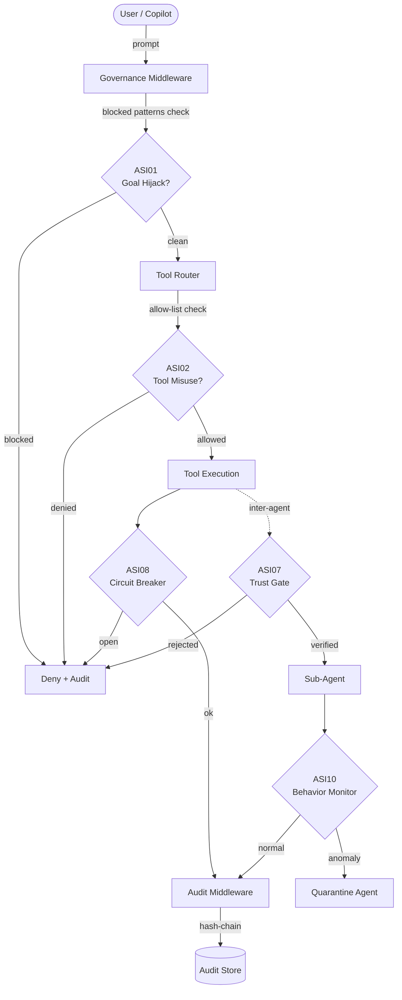
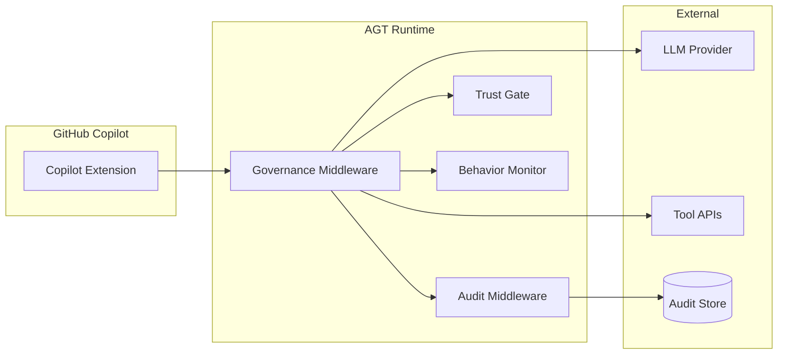

<!-- Copyright (c) Microsoft Corporation. -->
<!-- Licensed under the MIT License. -->

# OWASP Agentic Security Initiative (ASI 2026) — Reference Architecture

> **Disclaimer**: This document is an internal self-assessment mapping, NOT a validated certification or third-party audit. It documents how the toolkit's capabilities align with the referenced standard. Organizations must perform their own compliance assessments with qualified auditors.

> **Version:** 1.0 · **Taxonomy:** OWASP ASI 2026 (ASI01–ASI11)
> **Scope:** Agent Governance Toolkit (AGT) mitigation patterns, code evidence, and gap analysis.

---

## Executive Summary

The [OWASP Agentic Security Initiative](https://genai.owasp.org/agentic-security-initiative/)
defines **11 risks** (ASI01–ASI11) specific to autonomous AI agent systems.
This document maps every risk to concrete AGT mitigation patterns, links to
implementation evidence, and provides an honest coverage assessment.

## Coverage Summary

| ASI ID | Risk Title | Coverage | Primary AGT Component |
|--------|-----------|----------|----------------------|
| ASI01 | Agent Goal Hijack | ✅ Full | `governanceMiddleware` — `blockedPatterns` |
| ASI02 | Tool Misuse and Exploitation | ✅ Full | `createGovernedTool` — allow/deny-lists |
| ASI03 | Identity and Privilege Abuse | ✅ Full | PII redaction, RBAC in policy YAML |
| ASI04 | Agentic Supply Chain | ⚠️ Partial | Policy YAML tool pinning; no SBOM |
| ASI05 | Unexpected Code Execution | ✅ Full | Static reviewer detects pickle/eval |
| ASI06 | Memory and Context Poisoning | ⚠️ Partial | Audit hash-chain; no memory sandbox |
| ASI07 | Insecure Inter-Agent Communication | ✅ Full | Trust-gate with DID verification |
| ASI08 | Cascading Failures | ✅ Full | Circuit breaker, rate limiter |
| ASI09 | Human-Agent Trust Exploitation | ⚠️ Partial | Audit trail; no UI-level guardrails |
| ASI10 | Rogue Agents | ✅ Full | `AgentBehaviorMonitor`, quarantine |
| ASI11 | Agent Untraceability | ✅ Full | Tamper-evident audit log (hash chain) |

**Overall: 8/11 Full, 3/11 Partial, 0 Gaps.**

---

## Top-Level Architecture

---

## Risk Details

### ASI01 — Agent Goal Hijack

**Risk:** Adversarial inputs override an agent's intended goal.

**AGT Mitigation:** The `governanceMiddleware` applies `blockedPatterns` (regex)
to every inbound message before it reaches the LLM. Patterns are loaded from
the policy YAML at runtime — not hardcoded in source.

**Evidence:**
- `agent-governance-python/agent-os/src/agent_os/governance/middleware.py` — `_check_blocked_patterns()`
- `agent-governance-python/agentmesh-integrations/copilot-governance/src/reviewer.ts` — rule `no-prompt-injection-guards`

**Coverage:** ✅ Full

---

### ASI02 — Tool Misuse and Exploitation

**Risk:** An agent invokes tools in unintended or dangerous ways.

**AGT Mitigation:** `createGovernedTool` wraps every tool with allow-list /
deny-list enforcement and per-tool rate limits. The static reviewer flags
unguarded `.execute()` calls.

**Evidence:**
- `agent-governance-python/agent-os/src/agent_os/governance/tool_wrapper.py`
- `agent-governance-python/agentmesh-integrations/copilot-governance/src/reviewer.ts` — rules `unguarded-tool-execution`, `no-tool-allowlist`

**Coverage:** ✅ Full

---

### ASI03 — Identity and Privilege Abuse

**Risk:** Agents acquire privileges beyond their role, exposing sensitive data.

**AGT Mitigation:** PII redaction middleware strips sensitive fields before
forwarding. Policy YAML supports field-level `pii_fields` configuration.

**Evidence:**
- `agent-governance-python/agent-os/src/agent_os/governance/middleware.py` — `_redact_pii()`
- `agent-governance-python/agentmesh-integrations/copilot-governance/src/reviewer.ts` — rule `missing-pii-redaction`

**Coverage:** ✅ Full

---

### ASI04 — Agentic Supply Chain Vulnerabilities

**Risk:** Compromised plugins or sub-agents inject malicious behaviour.

**AGT Mitigation:** Policy YAML `allowed_tools` pins the exact set of
permitted tool IDs. The static reviewer detects hardcoded deny-lists (which
attackers can reverse-engineer) and recommends externalised config.

**Known Gap:** No SBOM generation or dependency vulnerability scanning is
built into AGT. Recommend integrating with GitHub Advanced Security /
Dependabot for dependency-level supply-chain coverage.

**Evidence:**
- `agent-governance-python/agentmesh-integrations/copilot-governance/src/reviewer.ts` — rule `hardcoded-security-denylist`
- Policy YAML schema: `allowed_tools`, `blocked_tools`

**Coverage:** ⚠️ Partial

---

### ASI05 — Unexpected Code Execution (RCE)

**Risk:** Agent-driven code paths achieve arbitrary code execution.

**AGT Mitigation:** The static reviewer detects `pickle.loads()` without HMAC
verification and flags it as critical. The governance policy blocks `eval()`
and `exec()` in agent code via lint rules.

**Evidence:**
- `agent-governance-python/agentmesh-integrations/copilot-governance/src/reviewer.ts` — rule `unsafe-deserialization`

**Coverage:** ✅ Full

---

### ASI06 — Memory and Context Poisoning

**Risk:** Persistent memory stores are manipulated to corrupt future decisions.

**AGT Mitigation:** The audit hash-chain provides tamper detection for any
persisted state. However, AGT does not yet sandbox agent memory stores or
provide memory integrity checksums at the application layer.

**Known Gap:** No dedicated memory-sandbox or context-integrity module.
Consider adding a `ContextValidator` that hashes memory snapshots.

**Evidence:**
- `agent-governance-python/agent-os/src/agent_os/audit/hash_chain.py`

**Coverage:** ⚠️ Partial

---

### ASI07 — Insecure Inter-Agent Communication

**Risk:** Messages between agents lack authentication or integrity verification.

**AGT Mitigation:** The trust-gate requires DID-based identity verification
before any agent-to-agent handoff. The static reviewer detects missing trust
verification in multi-agent orchestration code.

**Evidence:**
- `agent-governance-python/agent-os/src/agent_os/trust/gate.py`
- `agent-governance-python/agentmesh-integrations/copilot-governance/src/reviewer.ts` — rule `missing-trust-verification`

**Coverage:** ✅ Full

---

### ASI08 — Cascading Failures

**Risk:** A failure in one agent propagates through the system.

**AGT Mitigation:** The circuit-breaker pattern opens after N consecutive
failures, preventing cascade. Rate limiting caps per-minute tool invocations.

**Evidence:**
- `agent-governance-python/agentmesh-integrations/copilot-governance/src/reviewer.ts` — rule `missing-circuit-breaker`
- `agent-governance-python/agent-os/src/agent_os/governance/middleware.py` — `_rate_limit_check()`

**Coverage:** ✅ Full

---

### ASI09 — Human-Agent Trust Exploitation

**Risk:** Humans over-trust agent outputs and skip validation.

**AGT Mitigation:** Tamper-evident audit logs let reviewers verify what the
agent actually did. The static reviewer flags code with no audit logging.

**Known Gap:** No UI-level confirmation dialogs or "human-in-the-loop"
approval workflows are built into AGT. Consider adding a `HumanApproval`
middleware for high-risk actions.

**Evidence:**
- `agent-governance-python/agentmesh-integrations/copilot-governance/src/reviewer.ts` — rule `missing-audit-logging`

**Coverage:** ⚠️ Partial

---

### ASI10 — Rogue Agents

**Risk:** An agent deviates from intended behaviour.

**AGT Mitigation:** `AgentBehaviorMonitor` tracks per-agent metrics (tool call
rate, failure rate, privilege escalation attempts) and quarantines agents that
exceed thresholds.

**Evidence:**
- `agent-governance-python/agent-os/src/agent_os/services/behavior_monitor.py`
- `agent-governance-python/agentmesh-integrations/copilot-governance/src/reviewer.ts` — rule `no-behavior-monitoring`

**Coverage:** ✅ Full

---

### ASI11 — Agent Untraceability

**Risk:** Agent actions lack logging, provenance, or audit trails.

**AGT Mitigation:** The audit middleware produces a hash-chain log where each
entry contains the SHA-256 of the previous entry, making tampering detectable.
The static reviewer flags code without audit logging.

**Evidence:**
- `agent-governance-python/agent-os/src/agent_os/audit/hash_chain.py`
- `agent-governance-python/agentmesh-integrations/copilot-governance/src/reviewer.ts` — rule `missing-audit-logging`

**Coverage:** ✅ Full

---

## Deployment Architecture

## Lessons Learned

1. **Hardcoded deny-lists are discoverable.** External security researchers
   reverse-engineered blocked-pattern lists from source code. Externalise
   security rules into runtime-loaded YAML configs.

2. **Stub `verify()` functions are a recurring root cause.** Two separate
   incidents traced back to `return True` stubs in trust verification.
   The static reviewer now flags these as critical.

3. **Unbounded dictionaries cause memory DoS.** Session caches and
   rate-limit buckets need explicit size limits and eviction policies.

4. **Backward compatibility matters.** When migrating from AT→ASI taxonomy,
   provide a legacy lookup map so existing integrations don't break silently.

---

*Generated for Agent Governance Toolkit · OWASP ASI 2026 Taxonomy*
