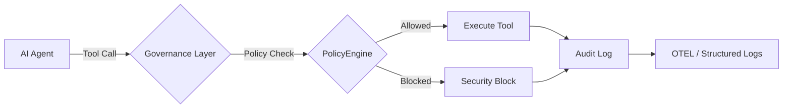

# 🚀 10分で始めるクイックスタートガイド

ゼロからガバナンスされたAIエージェントを10分以内に構築できます。

> **前提条件:** Python 3.10以上 / Node.js 18以上 / .NET 8.0以上 (いずれか1つ以上)

## アーキテクチャ概要

ガバナンスレイヤーは、エージェントのすべてのアクションを実行前にチェックします。



## 1. インストール

ガバナンスツールキットをインストールします。

```bash
pip install agent-governance-toolkit[full]
```

または、個別のパッケージをインストールします。

```bash
pip install agent-os-kernel        # Policy enforcement + framework integrations
pip install agentmesh-platform     # Zero-trust identity + trust cards
pip install agent-governance-toolkit    # OWASP ASI verification + integrity CLI
pip install agent-sre              # SLOs, error budgets, chaos testing
pip install agentmesh-runtime       # Execution supervisor + privilege rings
pip install agentmesh-marketplace      # Plugin lifecycle management
pip install agentmesh-lightning        # RL training governance
```

### TypeScript / Node.js

```bash
npm install @microsoft/agentmesh-sdk
```

### .NET

```bash
dotnet add package Microsoft.AgentGovernance
```

## 2. インストールの確認

付属の検証スクリプトを実行します。

```bash
python scripts/check_gov.py
```

または、ガバナンスCLIを直接使用します。

```bash
agent-governance verify
agent-governance verify --badge
```

## 3. 最初のガバナンスされたエージェント

`governed_agent.py` というファイルを作成します。

```python
from agent_os.policy import PolicyEngine, CapabilityModel, PolicyScope

# Define what your agent is allowed to do
capabilities = CapabilityModel(
    allowed_tools=["web_search", "read_file", "send_email"],
    blocked_tools=["execute_code", "delete_file"],
    blocked_patterns=[r"\b\d{3}-\d{2}-\d{4}\b"],  # Block SSN patterns
    require_human_approval=True,
    max_tool_calls=10,
)

# Create a policy engine
engine = PolicyEngine(capabilities=capabilities)

# Every agent action goes through the policy engine
result = engine.evaluate(action="web_search", input_text="latest AI news")
print(f"Action allowed: {result.allowed}")
print(f"Reason: {result.reason}")

# This will be blocked
result = engine.evaluate(action="delete_file", input_text="/etc/passwd")
print(f"Action allowed: {result.allowed}")  # False
print(f"Reason: {result.reason}")           # "Tool 'delete_file' is blocked"
```

実行します。

```bash
python governed_agent.py
```

### 最初のガバナンスされたエージェント — TypeScript

`governed_agent.ts` というファイルを作成します。

```typescript
import { PolicyEngine, AgentIdentity, AuditLogger } from "@microsoft/agentmesh-sdk";

const identity = AgentIdentity.generate("my-agent", ["web_search", "read_file"]);

const engine = new PolicyEngine([
  { action: "web_search", effect: "allow" },
  { action: "delete_file", effect: "deny" },
]);

console.log(engine.evaluate("web_search"));  // "allow"
console.log(engine.evaluate("delete_file")); // "deny"
```

### 最初のガバナンスされたエージェント — .NET

`GovernedAgent.cs` というファイルを作成します。

```csharp
using AgentGovernance;
using AgentGovernance.Policy;

var kernel = new GovernanceKernel(new GovernanceOptions
{
    PolicyPaths = new() { "policies/default.yaml" },
    EnablePromptInjectionDetection = true,
});

var result = kernel.EvaluateToolCall("did:mesh:agent-1", "web_search", new() { ["query"] = "AI news" });
Console.WriteLine($"Allowed: {result.Allowed}");  // True (if policy permits)

result = kernel.EvaluateToolCall("did:mesh:agent-1", "delete_file", new() { ["path"] = "/etc/passwd" });
Console.WriteLine($"Allowed: {result.Allowed}");  // False
```

## 4. 既存のフレームワークに組み込む

このツールキットは、主要なエージェントフレームワークすべてと統合できます。以下に LangChain の例を示します。

```python
from agent_os import KernelSpace
from agent_os.policy import CapabilityModel

# Initialize with governance
kernel = KernelSpace(
    capabilities=CapabilityModel(
        allowed_tools=["web_search", "calculator"],
        max_tool_calls=5,
    )
)

# Wrap your LangChain agent — every tool call is now governed
governed_agent = kernel.wrap(your_langchain_agent)
```

サポートされているフレームワーク: **LangChain**, **OpenAI Agents SDK**, **AutoGen**, **CrewAI**,
**Google ADK**, **Semantic Kernel**, **LlamaIndex**, **Anthropic**, **Mistral**, **Gemini** など。

## 5. OWASP ASI 2026 のカバレッジを確認する

導入した環境が OWASP Agentic Security Threats をカバーしているかを確認します。

```bash
# Text summary
agent-governance verify

# JSON for CI/CD pipelines
agent-governance verify --json

# Badge for your README
agent-governance verify --badge
```

### セキュアなエラーハンドリング

このツールキットに含まれるすべての CLI ツールは、内部情報の漏洩を防ぐために強化されています。JSON モードでコマンドが失敗した場合、サニタイズされたスキーマが返されます。

```json
{
  "status": "error",
  "message": "An internal error occurred during verification",
  "type": "InternalError"
}
```

既知のエラー（例: "File not found"）では具体的なエラーメッセージが表示されます。一方、予期しないシステムエラーは、セキュリティの完全性を確保するためにマスクされます。

## 6. モジュールの整合性を確認する

ガバナンスモジュールが改ざんされていないことを確認します。

```bash
# Generate a baseline integrity manifest
agent-governance integrity --generate integrity.json

# Verify against the manifest later
agent-governance integrity --manifest integrity.json
```

## 次のステップ

| 内容 | リンク |
|------|--------|
| 完全なAPIリファレンス (Python) | [agent-governance-python/agent-os/README.md](agent-governance-python/agent-os/README.md) |
| TypeScript パッケージ ドキュメント | [agent-governance-typescript/README.md](../../agent-governance-typescript/README.md) |
| .NET パッケージ ドキュメント | [agent-governance-dotnet/README.md](agent-governance-dotnet/README.md) |
| OWASP カバレッジマップ | [docs/OWASP-COMPLIANCE.md](docs/OWASP-COMPLIANCE.md) |
| フレームワーク統合 | [agent-governance-python/agent-os/src/agent_os/integrations/](agent-governance-python/agent-os/src/agent_os/integrations/) |
| サンプルアプリケーション | [agent-governance-python/agent-os/examples/](agent-governance-python/agent-os/examples/) |
| コントリビュートガイド | [CONTRIBUTING.md](CONTRIBUTING.md) |
| 変更履歴 | [CHANGELOG.md](CHANGELOG.md) |

---

*本クイックスタートは、 [@davidequarracino](https://github.com/davidequarracino) による初期の貢献 ([#106](https://github.com/microsoft/agent-governance-toolkit/pull/106), [#108](https://github.com/microsoft/agent-governance-toolkit/pull/108)) に基づいています。*

