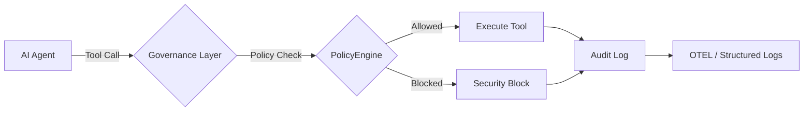

# 🚀 10分钟快速入门指南

从零开始，在10分钟内构建受治理的AI智能体。

> **前提条件：** Python 3.10+ / Node.js 18+ / .NET 8.0+（任选其一或多个）

## 架构概述

治理层在执行前拦截每个智能体操作：



## 1. 安装

安装治理工具包：

```bash
pip install agent-governance-toolkit[full]
```

或安装单独的包：

```bash
pip install agent-os-kernel        # 策略执行 + 框架集成
pip install agentmesh-platform     # 零信任身份 + 信任卡
pip install agent-governance-toolkit    # OWASP ASI 验证 + 完整性 CLI
pip install agent-sre              # SLO、错误预算、混沌测试
pip install agentmesh-runtime       # 执行监督 + 权限环
pip install agentmesh-marketplace      # 插件生命周期管理
pip install agentmesh-lightning        # 强化学习训练治理
```

### TypeScript / Node.js

```bash
npm install @microsoft/agentmesh-sdk
```

### .NET

```bash
dotnet add package Microsoft.AgentGovernance
```

## 2. 验证安装

运行内置的验证脚本：

```bash
python scripts/check_gov.py
```

或直接使用治理 CLI：

```bash
agent-governance verify
agent-governance verify --badge
```

## 3. 你的第一个受治理智能体

创建一个名为 `governed_agent.py` 的文件：

```python
from agent_os.policies import PolicyEvaluator, PolicyDecision
from agent_os.policies.schema import (
    PolicyDocument, PolicyRule, PolicyCondition,
    PolicyAction, PolicyOperator, PolicyDefaults,
)

# 内联定义治理规则（或从 YAML 加载 — 见下文）
policy = PolicyDocument(
    name="agent-safety",
    version="1.0",
    description="示例安全策略",
    defaults=PolicyDefaults(action=PolicyAction.ALLOW),
    rules=[
        PolicyRule(
            name="block-dangerous-tools",
            condition=PolicyCondition(
                field="tool_name",
                operator=PolicyOperator.IN,
                value=["execute_code", "delete_file", "shell_exec"],
            ),
            action=PolicyAction.DENY,
            message="工具被策略阻止",
            priority=100,
        ),
    ],
)

evaluator = PolicyEvaluator(policies=[policy])

# 允许
result = evaluator.evaluate({"tool_name": "web_search", "input_text": "latest AI news"})
print(f"操作允许: {result.allowed}")   # True

# 阻止 — 确定性
result = evaluator.evaluate({"tool_name": "delete_file", "input_text": "/etc/passwd"})
print(f"操作允许: {result.allowed}")   # False
print(f"原因: {result.reason}")       # "工具被策略阻止"
```

运行：

```bash
python governed_agent.py
```

## 4. 包装现有框架

工具包与所有主要智能体框架集成：

```bash
pip install langchain-agentmesh      # LangChain 适配器
pip install llamaindex-agentmesh     # LlamaIndex 适配器
pip install crewai-agentmesh         # CrewAI 适配器
```

支持的框架：**LangChain**、**OpenAI Agents SDK**、**AutoGen**、**CrewAI**、
**Google ADK**、**Semantic Kernel**、**LlamaIndex**、**Anthropic**、**Mistral**、**Gemini** 等。

## 5. 检查 OWASP ASI 2026 覆盖率

验证你的部署是否覆盖了 OWASP 智能体安全威胁：

```bash
agent-governance verify
agent-governance verify --json
agent-governance verify --badge
```

## 后续步骤

| 内容 | 位置 |
|------|------|
| 完整 API 参考（Python） | [agent-governance-python/agent-os/README.md](../../agent-governance-python/agent-os/README.md) |
| TypeScript 包文档 | [agent-governance-typescript/README.md](../../agent-governance-typescript/README.md) |
| .NET 包文档 | [agent-governance-dotnet/README.md](../../agent-governance-dotnet/README.md) |
| OWASP 覆盖图 | [docs/OWASP-COMPLIANCE.md](../OWASP-COMPLIANCE.md) |
| 贡献指南 | [CONTRIBUTING.md](../../CONTRIBUTING.md) |

---

*基于 [@davidequarracino](https://github.com/davidequarracino) 的初始快速入门贡献。*

